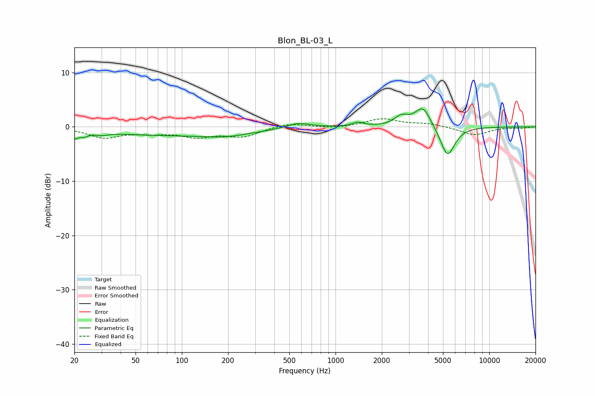

# Blon_BL-03_L
See [usage instructions](https://github.com/jaakkopasanen/AutoEq#usage) for more options and info.

### Parametric EQs
Apply preamp of -3.4 dB when using parametric equalizer.

|   # | Type    |   Fc (Hz) |    Q |   Gain (dB) |
|-----|---------|-----------|------|-------------|
|   1 | Peaking |        20 | 5.3  |        -1.4 |
|   2 | Peaking |        23 | 5.79 |        -0.6 |
|   3 | Peaking |        30 | 3.17 |        -0.5 |
|   4 | Peaking |        90 | 0.27 |        -1.5 |
|   5 | Peaking |       191 | 1.06 |        -0.6 |
|   6 | Peaking |       573 | 1.76 |         1   |
|   7 | Peaking |      1400 | 3.76 |         0.7 |
|   8 | Peaking |      2681 | 3.06 |         1.7 |
|   9 | Peaking |      3702 | 2.73 |         3.8 |
|  10 | Peaking |      5352 | 2.96 |        -5.6 |

### Fixed Band EQs
When using fixed band (also called graphic) equalizer, apply preamp of **-1.6 dB** (if available) and set gains manually with these parameters.

|   # | Type    |   Fc (Hz) |    Q |   Gain (dB) |
|-----|---------|-----------|------|-------------|
|   1 | Peaking |        31 | 1.41 |        -1.9 |
|   2 | Peaking |        62 | 1.41 |        -0.9 |
|   3 | Peaking |       125 | 1.41 |        -1.6 |
|   4 | Peaking |       250 | 1.41 |        -1.7 |
|   5 | Peaking |       500 | 1.41 |         0.7 |
|   6 | Peaking |      1000 | 1.41 |        -0.3 |
|   7 | Peaking |      2000 | 1.41 |         1.5 |
|   8 | Peaking |      4000 | 1.41 |         0.6 |
|   9 | Peaking |      8000 | 1.41 |        -1.5 |
|  10 | Peaking |     16000 | 1.41 |        -0.2 |

### Graphs

