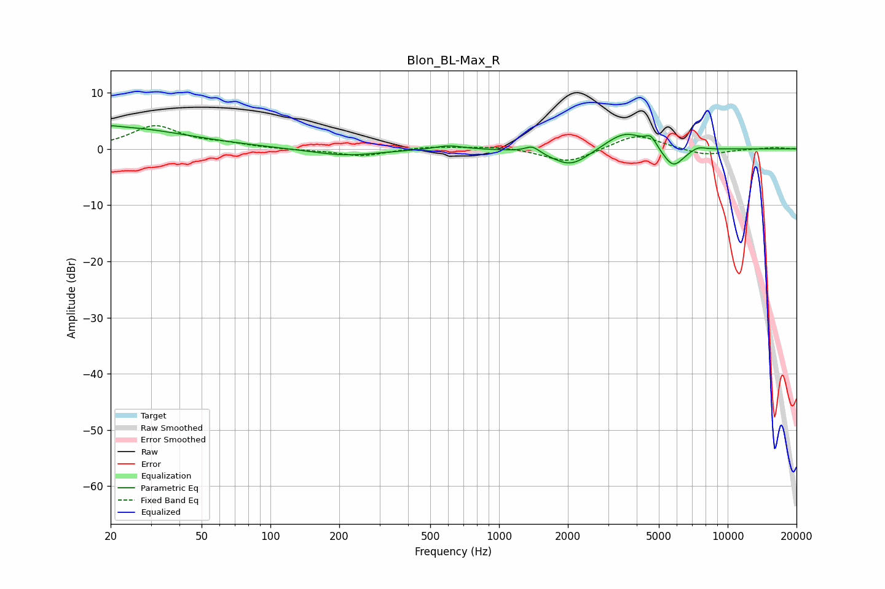

# Blon_BL-Max_R
See [usage instructions](https://github.com/jaakkopasanen/AutoEq#usage) for more options and info.

### Parametric EQs
Apply preamp of -4.2 dB when using parametric equalizer.

|   # | Type    |   Fc (Hz) |    Q |   Gain (dB) |
|-----|---------|-----------|------|-------------|
|   1 | Peaking |        20 | 0.44 |         3.9 |
|   2 | Peaking |        21 | 5.84 |         0.2 |
|   3 | Peaking |       212 | 0.94 |        -1.2 |
|   4 | Peaking |       603 | 2.26 |         0.7 |
|   5 | Peaking |      1398 | 4.61 |         1.2 |
|   6 | Peaking |      2060 | 1.69 |        -3.2 |
|   7 | Peaking |      3574 | 1.61 |         3.4 |
|   8 | Peaking |      4616 | 5.86 |         1.7 |
|   9 | Peaking |      5776 | 2.95 |        -3.7 |
|  10 | Peaking |      7423 | 3.98 |         0.7 |

### Fixed Band EQs
When using fixed band (also called graphic) equalizer, apply preamp of **-4.2 dB** (if available) and set gains manually with these parameters.

|   # | Type    |   Fc (Hz) |    Q |   Gain (dB) |
|-----|---------|-----------|------|-------------|
|   1 | Peaking |        31 | 1.41 |         4   |
|   2 | Peaking |        62 | 1.41 |         0.7 |
|   3 | Peaking |       125 | 1.41 |        -0.2 |
|   4 | Peaking |       250 | 1.41 |        -1.3 |
|   5 | Peaking |       500 | 1.41 |         0.5 |
|   6 | Peaking |      1000 | 1.41 |         0.5 |
|   7 | Peaking |      2000 | 1.41 |        -2.5 |
|   8 | Peaking |      4000 | 1.41 |         2.7 |
|   9 | Peaking |      8000 | 1.41 |        -1.2 |
|  10 | Peaking |     16000 | 1.41 |         0.3 |

### Graphs

