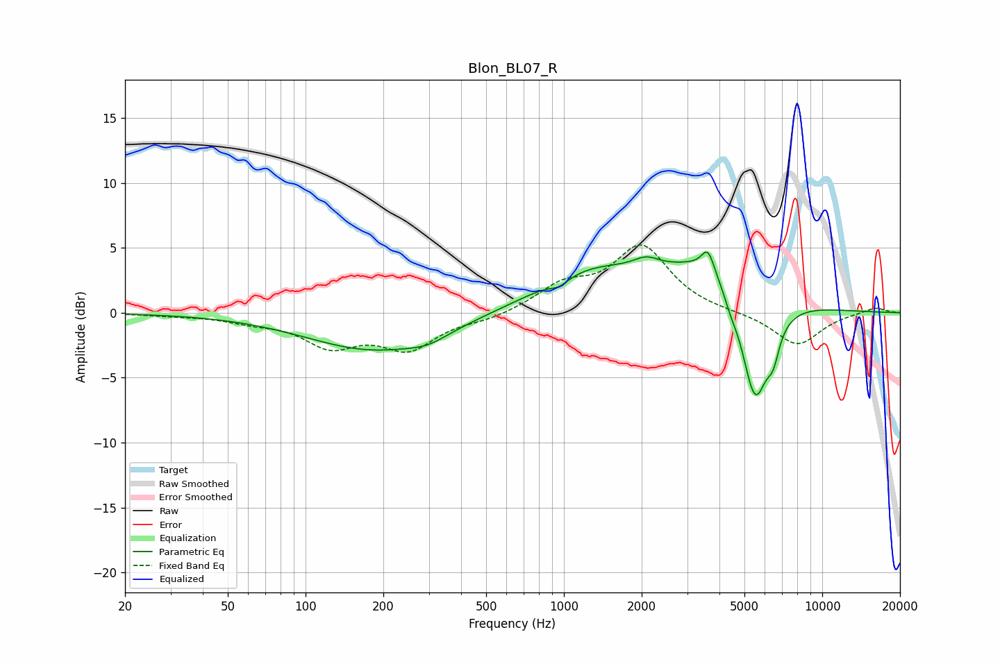

# Blon_BL07_R
See [usage instructions](https://github.com/jaakkopasanen/AutoEq#usage) for more options and info.

### Parametric EQs
Apply preamp of -4.8 dB when using parametric equalizer.

|   # | Type    |   Fc (Hz) |    Q |   Gain (dB) |
|-----|---------|-----------|------|-------------|
|   1 | Peaking |       185 | 0.54 |        -2.9 |
|   2 | Peaking |       298 | 1.8  |        -0.6 |
|   3 | Peaking |       958 | 3.75 |        -0.6 |
|   4 | Peaking |      1263 | 0.67 |         2.9 |
|   5 | Peaking |      2084 | 2.81 |         0.8 |
|   6 | Peaking |      3609 | 5.99 |         1.6 |
|   7 | Peaking |      3972 | 0.77 |         4.2 |
|   8 | Peaking |      4406 | 5.07 |        -0.9 |
|   9 | Peaking |      5488 | 2.4  |        -9.4 |
|  10 | Peaking |      6467 | 6    |        -1.8 |

### Fixed Band EQs
When using fixed band (also called graphic) equalizer, apply preamp of **-5.3 dB** (if available) and set gains manually with these parameters.

|   # | Type    |   Fc (Hz) |    Q |   Gain (dB) |
|-----|---------|-----------|------|-------------|
|   1 | Peaking |        31 | 1.41 |        -0.2 |
|   2 | Peaking |        62 | 1.41 |        -0.5 |
|   3 | Peaking |       125 | 1.41 |        -2.3 |
|   4 | Peaking |       250 | 1.41 |        -2.6 |
|   5 | Peaking |       500 | 1.41 |        -0.5 |
|   6 | Peaking |      1000 | 1.41 |         1.9 |
|   7 | Peaking |      2000 | 1.41 |         5   |
|   8 | Peaking |      4000 | 1.41 |        -0   |
|   9 | Peaking |      8000 | 1.41 |        -2.5 |
|  10 | Peaking |     16000 | 1.41 |         0.5 |

### Graphs

