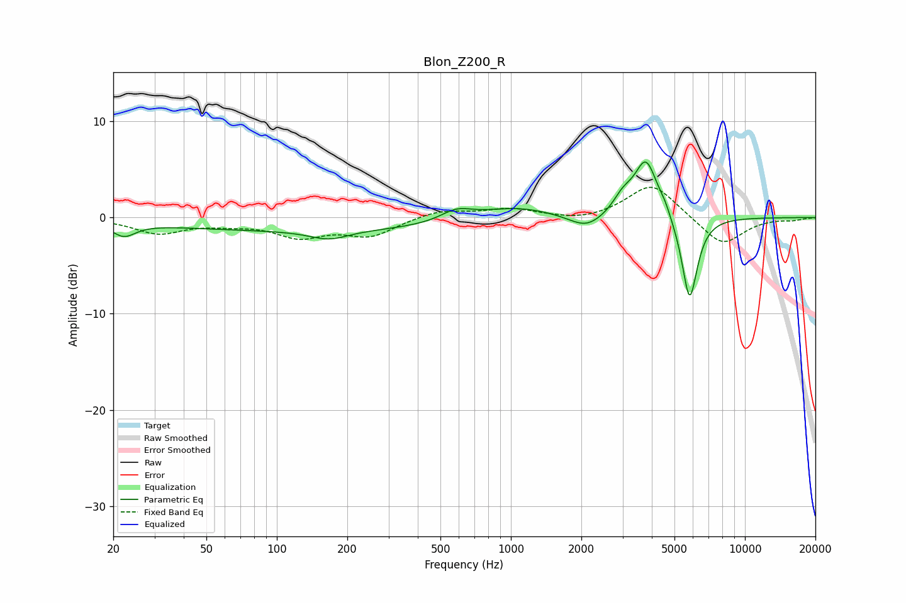

# Blon_Z200_R
See [usage instructions](https://github.com/jaakkopasanen/AutoEq#usage) for more options and info.

### Parametric EQs
Apply preamp of -5.9 dB when using parametric equalizer.

|   # | Type    |   Fc (Hz) |    Q |   Gain (dB) |
|-----|---------|-----------|------|-------------|
|   1 | Peaking |        22 | 2.85 |        -1.4 |
|   2 | Peaking |       147 | 0.18 |        -1.3 |
|   3 | Peaking |       167 | 1.7  |        -1   |
|   4 | Peaking |       586 | 2.05 |         1.2 |
|   5 | Peaking |      1031 | 0.86 |         1.4 |
|   6 | Peaking |      2103 | 1.91 |        -1.5 |
|   7 | Peaking |      3014 | 3.28 |         1.6 |
|   8 | Peaking |      3779 | 2.85 |         5.9 |
|   9 | Peaking |      4546 | 5.68 |         0.7 |
|  10 | Peaking |      5802 | 4.11 |        -8.9 |

### Fixed Band EQs
When using fixed band (also called graphic) equalizer, apply preamp of **-3.2 dB** (if available) and set gains manually with these parameters.

|   # | Type    |   Fc (Hz) |    Q |   Gain (dB) |
|-----|---------|-----------|------|-------------|
|   1 | Peaking |        31 | 1.41 |        -1.6 |
|   2 | Peaking |        62 | 1.41 |        -0.5 |
|   3 | Peaking |       125 | 1.41 |        -1.8 |
|   4 | Peaking |       250 | 1.41 |        -1.8 |
|   5 | Peaking |       500 | 1.41 |         0.8 |
|   6 | Peaking |      1000 | 1.41 |         0.9 |
|   7 | Peaking |      2000 | 1.41 |        -0.4 |
|   8 | Peaking |      4000 | 1.41 |         3.6 |
|   9 | Peaking |      8000 | 1.41 |        -3   |
|  10 | Peaking |     16000 | 1.41 |        -0.2 |

### Graphs

