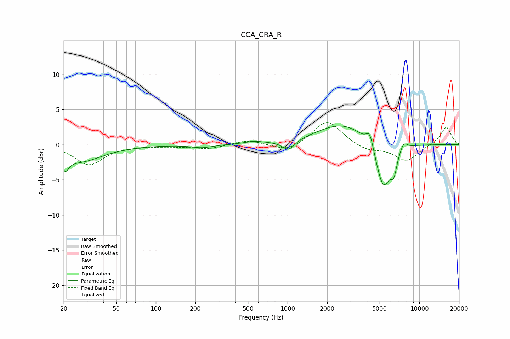

# CCA_CRA_R
See [usage instructions](https://github.com/jaakkopasanen/AutoEq#usage) for more options and info.

### Parametric EQs
Apply preamp of -2.8 dB when using parametric equalizer.

|   # | Type    |   Fc (Hz) |    Q |   Gain (dB) |
|-----|---------|-----------|------|-------------|
|   1 | Peaking |        21 | 5.59 |        -1.8 |
|   2 | Peaking |        26 | 0.81 |        -2.4 |
|   3 | Peaking |       225 | 1.82 |        -0.4 |
|   4 | Peaking |       558 | 2.02 |         0.3 |
|   5 | Peaking |      1017 | 3    |        -1.5 |
|   6 | Peaking |      2646 | 0.71 |         3.1 |
|   7 | Peaking |      4213 | 5.13 |         2.2 |
|   8 | Peaking |      5325 | 2.33 |        -7   |
|   9 | Peaking |      6409 | 5.88 |        -2.4 |
|  10 | Peaking |      7598 | 4.7  |         1.2 |

### Fixed Band EQs
When using fixed band (also called graphic) equalizer, apply preamp of **-3.2 dB** (if available) and set gains manually with these parameters.

|   # | Type    |   Fc (Hz) |    Q |   Gain (dB) |
|-----|---------|-----------|------|-------------|
|   1 | Peaking |        31 | 1.41 |        -2.8 |
|   2 | Peaking |        62 | 1.41 |        -0.1 |
|   3 | Peaking |       125 | 1.41 |        -0.2 |
|   4 | Peaking |       250 | 1.41 |        -0.6 |
|   5 | Peaking |       500 | 1.41 |         0.7 |
|   6 | Peaking |      1000 | 1.41 |        -1.1 |
|   7 | Peaking |      2000 | 1.41 |         3.5 |
|   8 | Peaking |      4000 | 1.41 |        -0.9 |
|   9 | Peaking |      8000 | 1.41 |        -2.3 |
|  10 | Peaking |     16000 | 1.41 |         2.6 |

### Graphs

