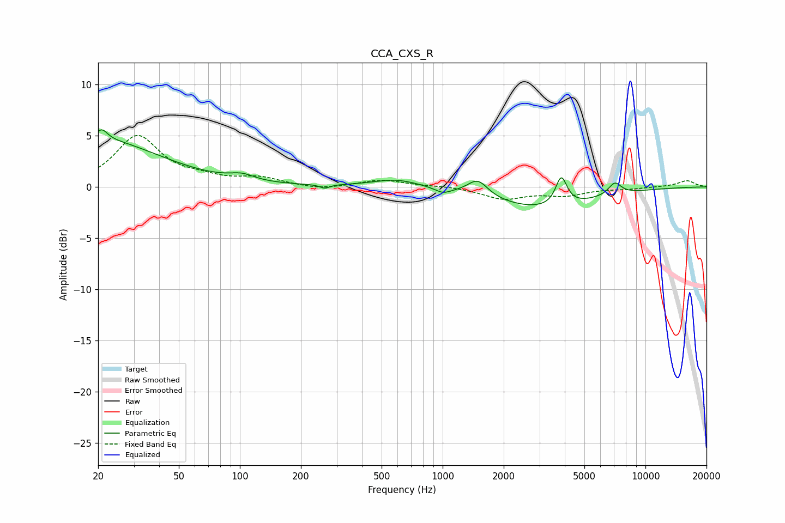

# CCA_CXS_R
See [usage instructions](https://github.com/jaakkopasanen/AutoEq#usage) for more options and info.

### Parametric EQs
Apply preamp of -5.7 dB when using parametric equalizer.

|   # | Type    |   Fc (Hz) |    Q |   Gain (dB) |
|-----|---------|-----------|------|-------------|
|   1 | Peaking |        20 | 0.47 |         4.5 |
|   2 | Peaking |        21 | 5.26 |         1   |
|   3 | Peaking |       102 | 2.34 |         0.6 |
|   4 | Peaking |       262 | 5.98 |        -0.4 |
|   5 | Peaking |       592 | 1.19 |         0.8 |
|   6 | Peaking |      1004 | 3.71 |        -0.5 |
|   7 | Peaking |      1490 | 2.82 |         1.6 |
|   8 | Peaking |      3074 | 0.56 |        -2.1 |
|   9 | Peaking |      3846 | 5.1  |         2.8 |
|  10 | Peaking |      7066 | 4.28 |         1.2 |

### Fixed Band EQs
When using fixed band (also called graphic) equalizer, apply preamp of **-5.1 dB** (if available) and set gains manually with these parameters.

|   # | Type    |   Fc (Hz) |    Q |   Gain (dB) |
|-----|---------|-----------|------|-------------|
|   1 | Peaking |        31 | 1.41 |         4.9 |
|   2 | Peaking |        62 | 1.41 |         0.6 |
|   3 | Peaking |       125 | 1.41 |         0.8 |
|   4 | Peaking |       250 | 1.41 |        -0.3 |
|   5 | Peaking |       500 | 1.41 |         0.7 |
|   6 | Peaking |      1000 | 1.41 |         0.1 |
|   7 | Peaking |      2000 | 1.41 |        -1.1 |
|   8 | Peaking |      4000 | 1.41 |        -0.7 |
|   9 | Peaking |      8000 | 1.41 |        -0.2 |
|  10 | Peaking |     16000 | 1.41 |         0.6 |

### Graphs

