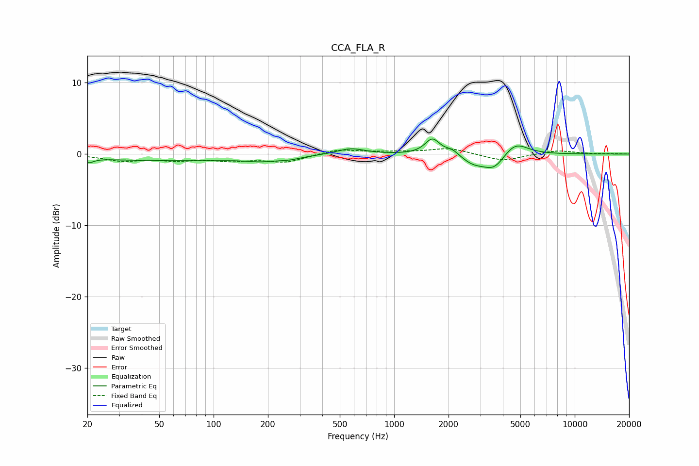

# CCA_FLA_R
See [usage instructions](https://github.com/jaakkopasanen/AutoEq#usage) for more options and info.

### Parametric EQs
Apply preamp of -2.2 dB when using parametric equalizer.

|   # | Type    |   Fc (Hz) |    Q |   Gain (dB) |
|-----|---------|-----------|------|-------------|
|   1 | Peaking |        20 | 5.85 |        -0.6 |
|   2 | Peaking |        59 | 0.26 |        -0.9 |
|   3 | Peaking |       185 | 1.69 |        -0.4 |
|   4 | Peaking |       262 | 2.4  |        -0.3 |
|   5 | Peaking |       575 | 1.82 |         0.9 |
|   6 | Peaking |      1628 | 3.51 |         2.2 |
|   7 | Peaking |      2097 | 3.68 |         0.8 |
|   8 | Peaking |      2748 | 2.05 |        -1.3 |
|   9 | Peaking |      3590 | 2.32 |        -2.1 |
|  10 | Peaking |      4659 | 2.03 |         2   |

### Fixed Band EQs
When using fixed band (also called graphic) equalizer, apply preamp of **-0.8 dB** (if available) and set gains manually with these parameters.

|   # | Type    |   Fc (Hz) |    Q |   Gain (dB) |
|-----|---------|-----------|------|-------------|
|   1 | Peaking |        31 | 1.41 |        -0.9 |
|   2 | Peaking |        62 | 1.41 |        -0.7 |
|   3 | Peaking |       125 | 1.41 |        -0.8 |
|   4 | Peaking |       250 | 1.41 |        -1.1 |
|   5 | Peaking |       500 | 1.41 |         0.7 |
|   6 | Peaking |      1000 | 1.41 |         0.2 |
|   7 | Peaking |      2000 | 1.41 |         0.8 |
|   8 | Peaking |      4000 | 1.41 |        -1   |
|   9 | Peaking |      8000 | 1.41 |         0.5 |
|  10 | Peaking |     16000 | 1.41 |         0.1 |

### Graphs

