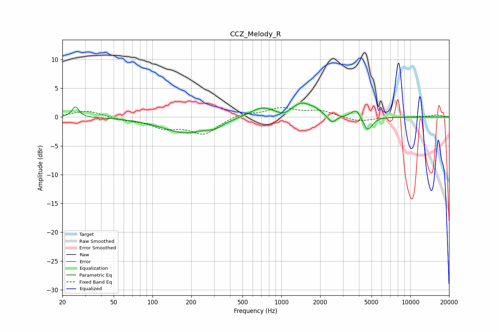

# CCZ_Melody_R
See [usage instructions](https://github.com/jaakkopasanen/AutoEq#usage) for more options and info.

### Parametric EQs
Apply preamp of -2.5 dB when using parametric equalizer.

|   # | Type    |   Fc (Hz) |    Q |   Gain (dB) |
|-----|---------|-----------|------|-------------|
|   1 | Peaking |        25 | 5.57 |         1.9 |
|   2 | Peaking |       181 | 0.77 |        -2.7 |
|   3 | Peaking |       307 | 2.74 |        -0.8 |
|   4 | Peaking |       703 | 1.5  |         1.7 |
|   5 | Peaking |      1041 | 2.99 |        -0.8 |
|   6 | Peaking |      1446 | 1.78 |         2.3 |
|   7 | Peaking |      1852 | 3.68 |         0.5 |
|   8 | Peaking |      2472 | 4.45 |        -1.4 |
|   9 | Peaking |      3799 | 4    |         1.5 |
|  10 | Peaking |      4671 | 3.95 |        -2.5 |

### Fixed Band EQs
When using fixed band (also called graphic) equalizer, apply preamp of **-1.7 dB** (if available) and set gains manually with these parameters.

|   # | Type    |   Fc (Hz) |    Q |   Gain (dB) |
|-----|---------|-----------|------|-------------|
|   1 | Peaking |        31 | 1.41 |         1.1 |
|   2 | Peaking |        62 | 1.41 |        -0.5 |
|   3 | Peaking |       125 | 1.41 |        -1.7 |
|   4 | Peaking |       250 | 1.41 |        -2.8 |
|   5 | Peaking |       500 | 1.41 |         0.7 |
|   6 | Peaking |      1000 | 1.41 |         1.5 |
|   7 | Peaking |      2000 | 1.41 |         1   |
|   8 | Peaking |      4000 | 1.41 |        -0.8 |
|   9 | Peaking |      8000 | 1.41 |         0   |
|  10 | Peaking |     16000 | 1.41 |         0.4 |

### Graphs

