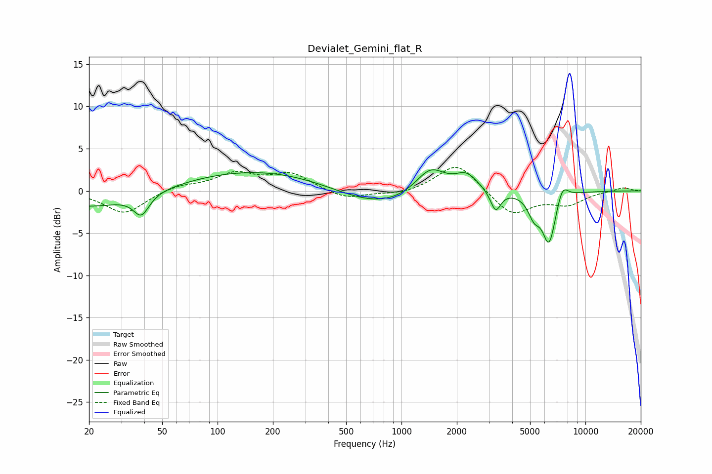

# Devialet_Gemini_flat_R
See [usage instructions](https://github.com/jaakkopasanen/AutoEq#usage) for more options and info.

### Parametric EQs
Apply preamp of -2.6 dB when using parametric equalizer.

|   # | Type    |   Fc (Hz) |    Q |   Gain (dB) |
|-----|---------|-----------|------|-------------|
|   1 | Peaking |        20 | 0.58 |        -2   |
|   2 | Peaking |        39 | 3.39 |        -2.5 |
|   3 | Peaking |       173 | 0.35 |         2.5 |
|   4 | Peaking |       735 | 0.6  |        -2.3 |
|   5 | Peaking |      1437 | 1.71 |         3.2 |
|   6 | Peaking |      2255 | 2.27 |         2   |
|   7 | Peaking |      3249 | 5.04 |        -2.5 |
|   8 | Peaking |      5261 | 4.11 |        -2.3 |
|   9 | Peaking |      6348 | 3.73 |        -6   |
|  10 | Peaking |      7492 | 4.31 |         2   |

### Fixed Band EQs
When using fixed band (also called graphic) equalizer, apply preamp of **-2.9 dB** (if available) and set gains manually with these parameters.

|   # | Type    |   Fc (Hz) |    Q |   Gain (dB) |
|-----|---------|-----------|------|-------------|
|   1 | Peaking |        31 | 1.41 |        -2.7 |
|   2 | Peaking |        62 | 1.41 |         0.7 |
|   3 | Peaking |       125 | 1.41 |         1.9 |
|   4 | Peaking |       250 | 1.41 |         2   |
|   5 | Peaking |       500 | 1.41 |        -1.1 |
|   6 | Peaking |      1000 | 1.41 |        -0.5 |
|   7 | Peaking |      2000 | 1.41 |         3.4 |
|   8 | Peaking |      4000 | 1.41 |        -2.9 |
|   9 | Peaking |      8000 | 1.41 |        -1.5 |
|  10 | Peaking |     16000 | 1.41 |         0.4 |

### Graphs

