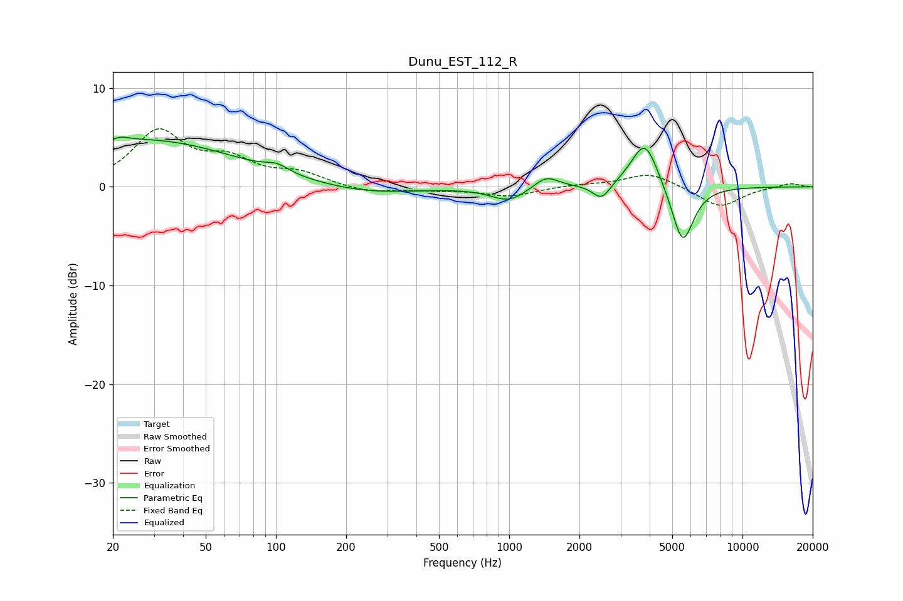

# Dunu_EST_112_R
See [usage instructions](https://github.com/jaakkopasanen/AutoEq#usage) for more options and info.

### Parametric EQs
Apply preamp of -5.1 dB when using parametric equalizer.

|   # | Type    |   Fc (Hz) |    Q |   Gain (dB) |
|-----|---------|-----------|------|-------------|
|   1 | Peaking |        22 | 5.75 |         2.9 |
|   2 | Peaking |        22 | 5.99 |        -2.5 |
|   3 | Peaking |        27 | 0.34 |         4.7 |
|   4 | Peaking |       101 | 2.93 |         0.7 |
|   5 | Peaking |       241 | 0.66 |        -0.8 |
|   6 | Peaking |       997 | 1.86 |        -1.4 |
|   7 | Peaking |      1440 | 2.65 |         1.3 |
|   8 | Peaking |      2488 | 3.77 |        -1.6 |
|   9 | Peaking |      3816 | 2.4  |         4.9 |
|  10 | Peaking |      5541 | 2.92 |        -6.1 |

### Fixed Band EQs
When using fixed band (also called graphic) equalizer, apply preamp of **-6.0 dB** (if available) and set gains manually with these parameters.

|   # | Type    |   Fc (Hz) |    Q |   Gain (dB) |
|-----|---------|-----------|------|-------------|
|   1 | Peaking |        31 | 1.41 |         5.4 |
|   2 | Peaking |        62 | 1.41 |         2.3 |
|   3 | Peaking |       125 | 1.41 |         1.2 |
|   4 | Peaking |       250 | 1.41 |        -0.6 |
|   5 | Peaking |       500 | 1.41 |        -0.3 |
|   6 | Peaking |      1000 | 1.41 |        -0.9 |
|   7 | Peaking |      2000 | 1.41 |         0.2 |
|   8 | Peaking |      4000 | 1.41 |         1.4 |
|   9 | Peaking |      8000 | 1.41 |        -2.1 |
|  10 | Peaking |     16000 | 1.41 |         0.4 |

### Graphs

