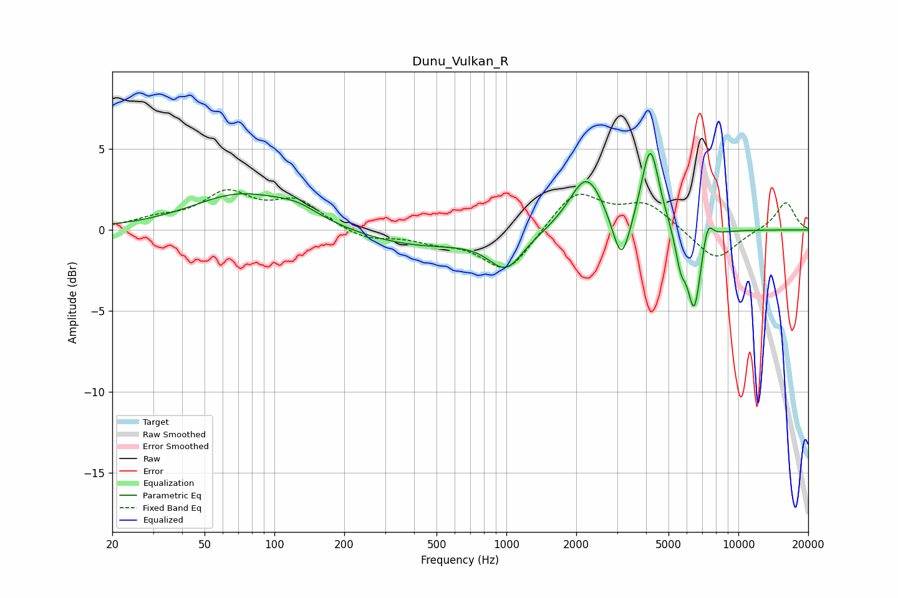

# Dunu_Vulkan_R
See [usage instructions](https://github.com/jaakkopasanen/AutoEq#usage) for more options and info.

### Parametric EQs
Apply preamp of -4.8 dB when using parametric equalizer.

|   # | Type    |   Fc (Hz) |    Q |   Gain (dB) |
|-----|---------|-----------|------|-------------|
|   1 | Peaking |        71 | 0.68 |         2.2 |
|   2 | Peaking |       126 | 1.46 |         0.7 |
|   3 | Peaking |       415 | 0.55 |        -1   |
|   4 | Peaking |       997 | 1.91 |        -2.1 |
|   5 | Peaking |      2218 | 1.91 |         3.5 |
|   6 | Peaking |      3133 | 3.78 |        -3.1 |
|   7 | Peaking |      4170 | 3.65 |         5.2 |
|   8 | Peaking |      5644 | 5.94 |        -1.9 |
|   9 | Peaking |      6453 | 4.63 |        -5   |
|  10 | Peaking |      7368 | 5.95 |         1.4 |

### Fixed Band EQs
When using fixed band (also called graphic) equalizer, apply preamp of **-2.6 dB** (if available) and set gains manually with these parameters.

|   # | Type    |   Fc (Hz) |    Q |   Gain (dB) |
|-----|---------|-----------|------|-------------|
|   1 | Peaking |        31 | 1.41 |         0.5 |
|   2 | Peaking |        62 | 1.41 |         2.1 |
|   3 | Peaking |       125 | 1.41 |         1.7 |
|   4 | Peaking |       250 | 1.41 |        -0.6 |
|   5 | Peaking |       500 | 1.41 |        -0.6 |
|   6 | Peaking |      1000 | 1.41 |        -2.7 |
|   7 | Peaking |      2000 | 1.41 |         2.4 |
|   8 | Peaking |      4000 | 1.41 |         1.6 |
|   9 | Peaking |      8000 | 1.41 |        -2   |
|  10 | Peaking |     16000 | 1.41 |         1.8 |

### Graphs

