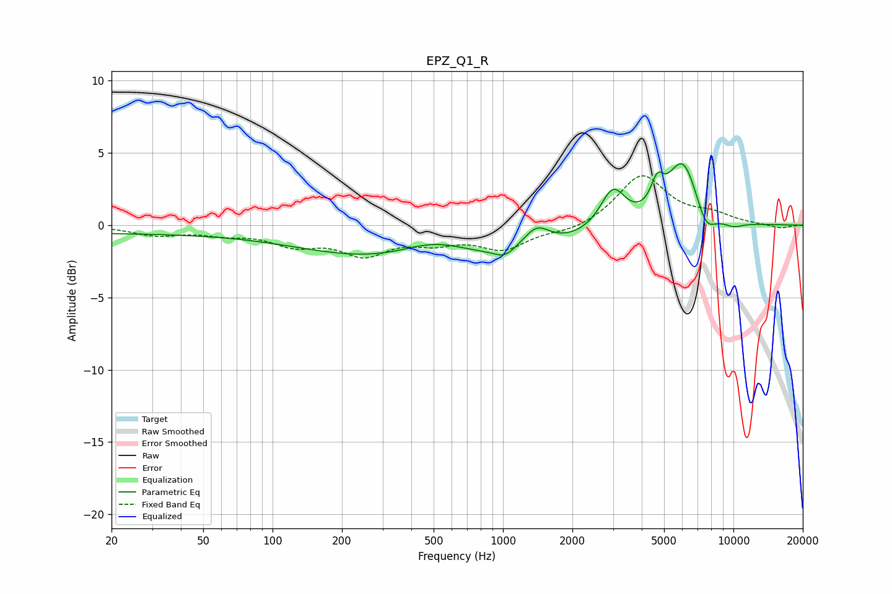

# EPZ_Q1_R
See [usage instructions](https://github.com/jaakkopasanen/AutoEq#usage) for more options and info.

### Parametric EQs
Apply preamp of -4.3 dB when using parametric equalizer.

|   # | Type    |   Fc (Hz) |    Q |   Gain (dB) |
|-----|---------|-----------|------|-------------|
|   1 | Peaking |        20 | 0.2  |        -0.5 |
|   2 | Peaking |       507 | 0.89 |         1.5 |
|   3 | Peaking |       512 | 0.26 |        -2.9 |
|   4 | Peaking |      1017 | 3.38 |        -0.6 |
|   5 | Peaking |      1400 | 2.45 |         1.5 |
|   6 | Peaking |      2997 | 2.57 |         2.8 |
|   7 | Peaking |      4672 | 5.03 |         1.8 |
|   8 | Peaking |      6026 | 2.03 |         4.5 |
|   9 | Peaking |      7591 | 3.13 |        -1.6 |
|  10 | Peaking |     10000 | 2.76 |        -0.4 |

### Fixed Band EQs
When using fixed band (also called graphic) equalizer, apply preamp of **-3.5 dB** (if available) and set gains manually with these parameters.

|   # | Type    |   Fc (Hz) |    Q |   Gain (dB) |
|-----|---------|-----------|------|-------------|
|   1 | Peaking |        31 | 1.41 |        -0.6 |
|   2 | Peaking |        62 | 1.41 |        -0.5 |
|   3 | Peaking |       125 | 1.41 |        -1.2 |
|   4 | Peaking |       250 | 1.41 |        -1.8 |
|   5 | Peaking |       500 | 1.41 |        -0.9 |
|   6 | Peaking |      1000 | 1.41 |        -1.5 |
|   7 | Peaking |      2000 | 1.41 |        -0.4 |
|   8 | Peaking |      4000 | 1.41 |         3.5 |
|   9 | Peaking |      8000 | 1.41 |         0.6 |
|  10 | Peaking |     16000 | 1.41 |        -0.2 |

### Graphs

