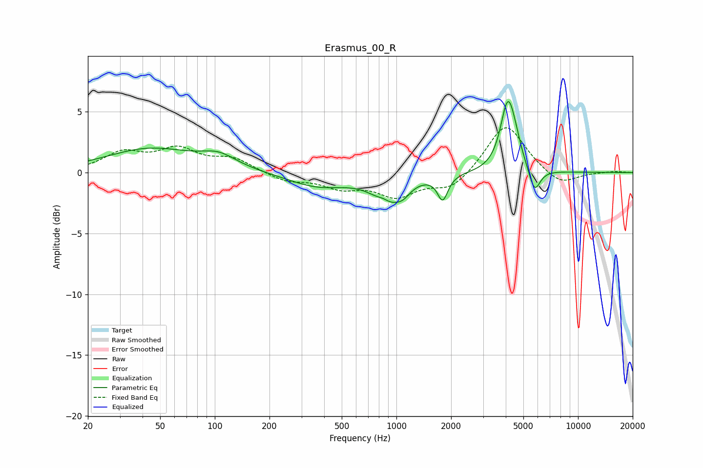

# Erasmus_00_R
See [usage instructions](https://github.com/jaakkopasanen/AutoEq#usage) for more options and info.

### Parametric EQs
Apply preamp of -5.9 dB when using parametric equalizer.

|   # | Type    |   Fc (Hz) |    Q |   Gain (dB) |
|-----|---------|-----------|------|-------------|
|   1 | Peaking |        44 | 0.59 |         1.9 |
|   2 | Peaking |       105 | 1.45 |         1   |
|   3 | Peaking |       371 | 0.85 |        -1.1 |
|   4 | Peaking |       848 | 3.97 |         0.5 |
|   5 | Peaking |       894 | 1.71 |        -2.2 |
|   6 | Peaking |      1089 | 3.66 |        -0.6 |
|   7 | Peaking |      1798 | 5.04 |        -2   |
|   8 | Peaking |      4089 | 3.63 |         5   |
|   9 | Peaking |      4459 | 3.58 |         1.5 |
|  10 | Peaking |      5759 | 4.38 |        -2.1 |

### Fixed Band EQs
When using fixed band (also called graphic) equalizer, apply preamp of **-3.8 dB** (if available) and set gains manually with these parameters.

|   # | Type    |   Fc (Hz) |    Q |   Gain (dB) |
|-----|---------|-----------|------|-------------|
|   1 | Peaking |        31 | 1.41 |         1.5 |
|   2 | Peaking |        62 | 1.41 |         1.7 |
|   3 | Peaking |       125 | 1.41 |         1.1 |
|   4 | Peaking |       250 | 1.41 |        -0.7 |
|   5 | Peaking |       500 | 1.41 |        -1.1 |
|   6 | Peaking |      1000 | 1.41 |        -1.8 |
|   7 | Peaking |      2000 | 1.41 |        -1.4 |
|   8 | Peaking |      4000 | 1.41 |         4.1 |
|   9 | Peaking |      8000 | 1.41 |        -1.1 |
|  10 | Peaking |     16000 | 1.41 |         0.1 |

### Graphs

