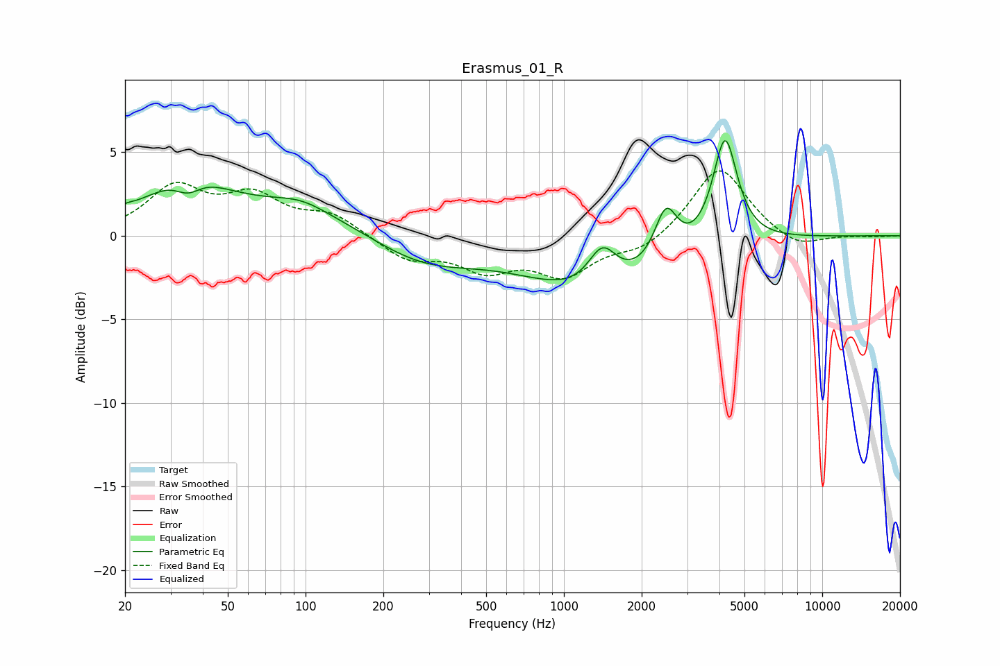

# Erasmus_01_R
See [usage instructions](https://github.com/jaakkopasanen/AutoEq#usage) for more options and info.

### Parametric EQs
Apply preamp of -5.8 dB when using parametric equalizer.

|   # | Type    |   Fc (Hz) |    Q |   Gain (dB) |
|-----|---------|-----------|------|-------------|
|   1 | Peaking |        20 | 5.9  |         0.2 |
|   2 | Peaking |        35 | 1.2  |         2.3 |
|   3 | Peaking |        35 | 2.54 |        -1.4 |
|   4 | Peaking |        74 | 0.24 |         1.9 |
|   5 | Peaking |        97 | 1.39 |         0.6 |
|   6 | Peaking |       276 | 0.64 |        -2.3 |
|   7 | Peaking |      1346 | 0.53 |        -3.4 |
|   8 | Peaking |      1409 | 2.52 |         2.4 |
|   9 | Peaking |      2482 | 3.21 |         3.1 |
|  10 | Peaking |      4205 | 3.01 |         6.4 |

### Fixed Band EQs
When using fixed band (also called graphic) equalizer, apply preamp of **-4.0 dB** (if available) and set gains manually with these parameters.

|   # | Type    |   Fc (Hz) |    Q |   Gain (dB) |
|-----|---------|-----------|------|-------------|
|   1 | Peaking |        31 | 1.41 |         2.8 |
|   2 | Peaking |        62 | 1.41 |         2.1 |
|   3 | Peaking |       125 | 1.41 |         1.2 |
|   4 | Peaking |       250 | 1.41 |        -1.4 |
|   5 | Peaking |       500 | 1.41 |        -1.8 |
|   6 | Peaking |      1000 | 1.41 |        -2.2 |
|   7 | Peaking |      2000 | 1.41 |        -0.9 |
|   8 | Peaking |      4000 | 1.41 |         4.2 |
|   9 | Peaking |      8000 | 1.41 |        -0.8 |
|  10 | Peaking |     16000 | 1.41 |        -0.1 |

### Graphs

