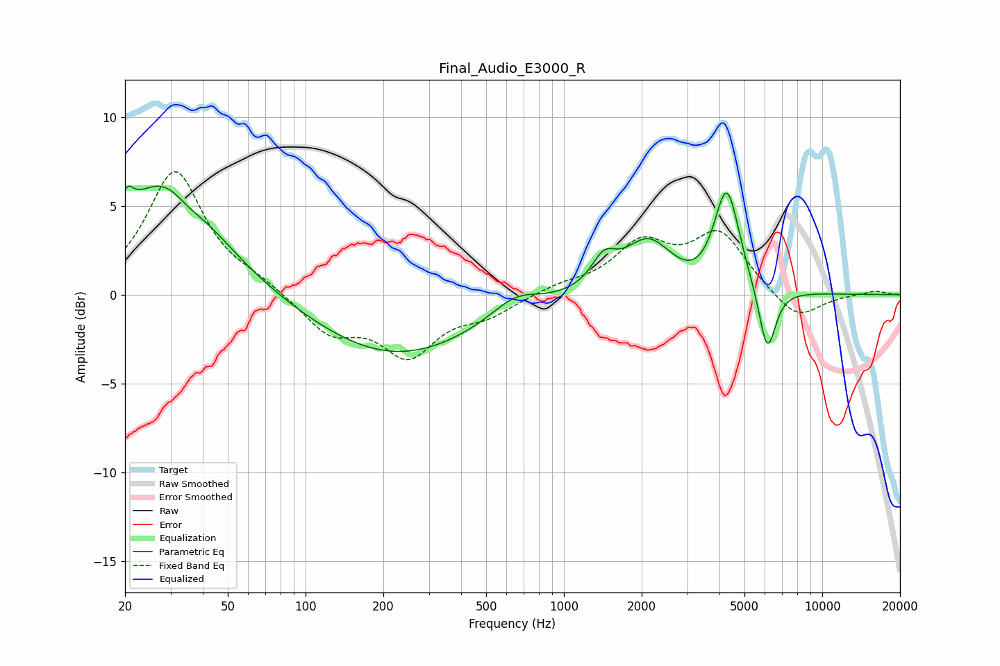

# Final_Audio_E3000_R
See [usage instructions](https://github.com/jaakkopasanen/AutoEq#usage) for more options and info.

### Parametric EQs
Apply preamp of -6.2 dB when using parametric equalizer.

|   # | Type    |   Fc (Hz) |    Q |   Gain (dB) |
|-----|---------|-----------|------|-------------|
|   1 | Peaking |        20 | 5.99 |         1.2 |
|   2 | Peaking |        29 | 0.76 |         6.8 |
|   3 | Peaking |        35 | 2.08 |        -0.9 |
|   4 | Peaking |       222 | 0.44 |        -3.5 |
|   5 | Peaking |       648 | 1.53 |         1.1 |
|   6 | Peaking |      1428 | 2.97 |         1.5 |
|   7 | Peaking |      2119 | 1.48 |         2.9 |
|   8 | Peaking |      3295 | 1.7  |        -0.5 |
|   9 | Peaking |      4270 | 2.83 |         5.9 |
|  10 | Peaking |      6127 | 4.14 |        -3.8 |

### Fixed Band EQs
When using fixed band (also called graphic) equalizer, apply preamp of **-7.0 dB** (if available) and set gains manually with these parameters.

|   # | Type    |   Fc (Hz) |    Q |   Gain (dB) |
|-----|---------|-----------|------|-------------|
|   1 | Peaking |        31 | 1.41 |         6.9 |
|   2 | Peaking |        62 | 1.41 |         0.5 |
|   3 | Peaking |       125 | 1.41 |        -2.1 |
|   4 | Peaking |       250 | 1.41 |        -3.2 |
|   5 | Peaking |       500 | 1.41 |        -1   |
|   6 | Peaking |      1000 | 1.41 |         0.5 |
|   7 | Peaking |      2000 | 1.41 |         2.7 |
|   8 | Peaking |      4000 | 1.41 |         3.3 |
|   9 | Peaking |      8000 | 1.41 |        -1.5 |
|  10 | Peaking |     16000 | 1.41 |         0.2 |

### Graphs

