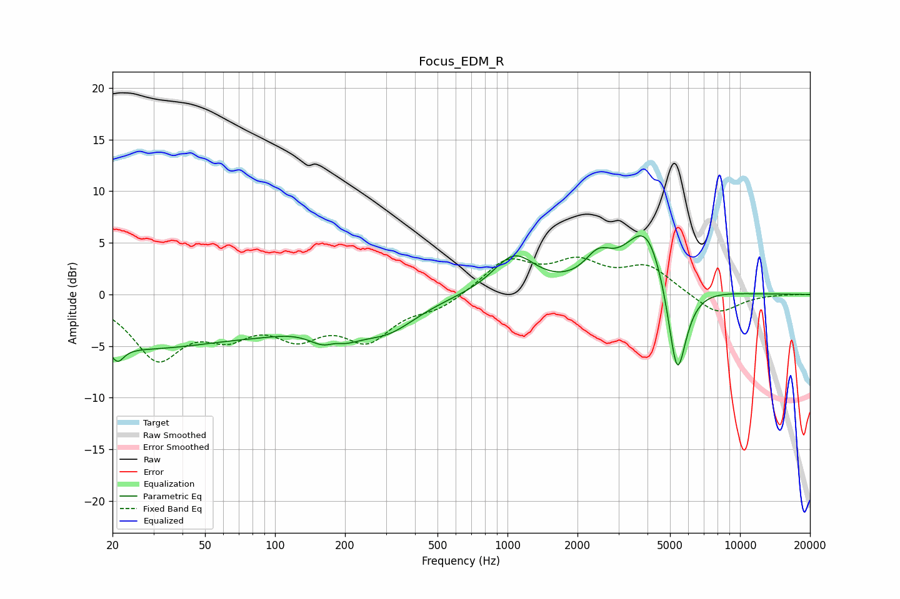

# Focus_EDM_R
See [usage instructions](https://github.com/jaakkopasanen/AutoEq#usage) for more options and info.

### Parametric EQs
Apply preamp of -5.8 dB when using parametric equalizer.

|   # | Type    |   Fc (Hz) |    Q |   Gain (dB) |
|-----|---------|-----------|------|-------------|
|   1 | Peaking |        21 | 5.46 |        -1.4 |
|   2 | Peaking |        25 | 0.31 |        -5   |
|   3 | Peaking |        93 | 0.83 |        -1   |
|   4 | Peaking |       178 | 1.85 |        -4.6 |
|   5 | Peaking |       180 | 2.84 |         2.3 |
|   6 | Peaking |       303 | 1.07 |        -2.9 |
|   7 | Peaking |      1068 | 1.55 |         3.7 |
|   8 | Peaking |      2452 | 2.44 |         2.4 |
|   9 | Peaking |      3970 | 1.51 |         7   |
|  10 | Peaking |      5364 | 3.28 |       -10.5 |

### Fixed Band EQs
When using fixed band (also called graphic) equalizer, apply preamp of **-3.7 dB** (if available) and set gains manually with these parameters.

|   # | Type    |   Fc (Hz) |    Q |   Gain (dB) |
|-----|---------|-----------|------|-------------|
|   1 | Peaking |        31 | 1.41 |        -5.8 |
|   2 | Peaking |        62 | 1.41 |        -3   |
|   3 | Peaking |       125 | 1.41 |        -3.3 |
|   4 | Peaking |       250 | 1.41 |        -3.9 |
|   5 | Peaking |       500 | 1.41 |        -1.2 |
|   6 | Peaking |      1000 | 1.41 |         3.2 |
|   7 | Peaking |      2000 | 1.41 |         2.7 |
|   8 | Peaking |      4000 | 1.41 |         2.5 |
|   9 | Peaking |      8000 | 1.41 |        -2   |
|  10 | Peaking |     16000 | 1.41 |         0   |

### Graphs

