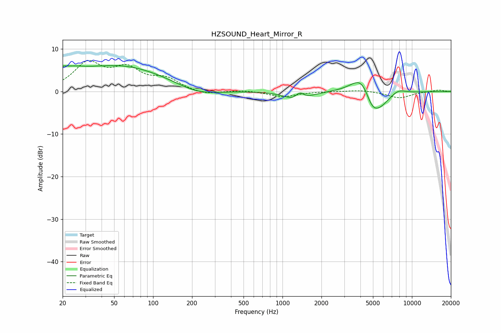

# HZSOUND_Heart_Mirror_R
See [usage instructions](https://github.com/jaakkopasanen/AutoEq#usage) for more options and info.

### Parametric EQs
Apply preamp of -6.2 dB when using parametric equalizer.

|   # | Type    |   Fc (Hz) |    Q |   Gain (dB) |
|-----|---------|-----------|------|-------------|
|   1 | Peaking |        20 | 5.69 |         0.7 |
|   2 | Peaking |        22 | 1.26 |         2.3 |
|   3 | Peaking |        57 | 0.4  |         5.9 |
|   4 | Peaking |       219 | 0.88 |        -1.8 |
|   5 | Peaking |      1328 | 1.94 |        -3.6 |
|   6 | Peaking |      1356 | 3.56 |         3.1 |
|   7 | Peaking |      4144 | 1.65 |         5.8 |
|   8 | Peaking |      4867 | 3.09 |        -2.3 |
|   9 | Peaking |      5334 | 1.48 |        -5.7 |
|  10 | Peaking |      7768 | 2.1  |         1.4 |

### Fixed Band EQs
When using fixed band (also called graphic) equalizer, apply preamp of **-7.4 dB** (if available) and set gains manually with these parameters.

|   # | Type    |   Fc (Hz) |    Q |   Gain (dB) |
|-----|---------|-----------|------|-------------|
|   1 | Peaking |        31 | 1.41 |         6.3 |
|   2 | Peaking |        62 | 1.41 |         4.7 |
|   3 | Peaking |       125 | 1.41 |         2.6 |
|   4 | Peaking |       250 | 1.41 |        -0.9 |
|   5 | Peaking |       500 | 1.41 |         0.3 |
|   6 | Peaking |      1000 | 1.41 |        -1.2 |
|   7 | Peaking |      2000 | 1.41 |         0   |
|   8 | Peaking |      4000 | 1.41 |         0.4 |
|   9 | Peaking |      8000 | 1.41 |        -1.5 |
|  10 | Peaking |     16000 | 1.41 |         0.4 |

### Graphs

