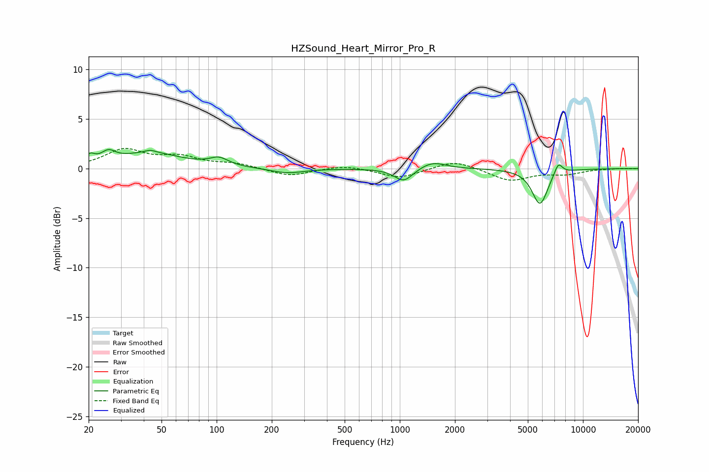

# HZSound_Heart_Mirror_Pro_R
See [usage instructions](https://github.com/jaakkopasanen/AutoEq#usage) for more options and info.

### Parametric EQs
Apply preamp of -2.0 dB when using parametric equalizer.

|   # | Type    |   Fc (Hz) |    Q |   Gain (dB) |
|-----|---------|-----------|------|-------------|
|   1 | Peaking |        20 | 5.62 |         0.8 |
|   2 | Peaking |        26 | 3.72 |         1   |
|   3 | Peaking |        43 | 0.82 |         1.5 |
|   4 | Peaking |        43 | 5.63 |         0.2 |
|   5 | Peaking |       103 | 2.83 |         0.8 |
|   6 | Peaking |       242 | 1.55 |        -0.5 |
|   7 | Peaking |      1051 | 2.82 |        -1.4 |
|   8 | Peaking |      1506 | 2    |         0.8 |
|   9 | Peaking |      5824 | 3.2  |        -3.6 |
|  10 | Peaking |      7335 | 5.93 |         1.2 |

### Fixed Band EQs
When using fixed band (also called graphic) equalizer, apply preamp of **-2.1 dB** (if available) and set gains manually with these parameters.

|   # | Type    |   Fc (Hz) |    Q |   Gain (dB) |
|-----|---------|-----------|------|-------------|
|   1 | Peaking |        31 | 1.41 |         1.8 |
|   2 | Peaking |        62 | 1.41 |         1   |
|   3 | Peaking |       125 | 1.41 |         0.5 |
|   4 | Peaking |       250 | 1.41 |        -0.8 |
|   5 | Peaking |       500 | 1.41 |         0.4 |
|   6 | Peaking |      1000 | 1.41 |        -1   |
|   7 | Peaking |      2000 | 1.41 |         0.9 |
|   8 | Peaking |      4000 | 1.41 |        -1.2 |
|   9 | Peaking |      8000 | 1.41 |        -0.5 |
|  10 | Peaking |     16000 | 1.41 |         0   |

### Graphs

