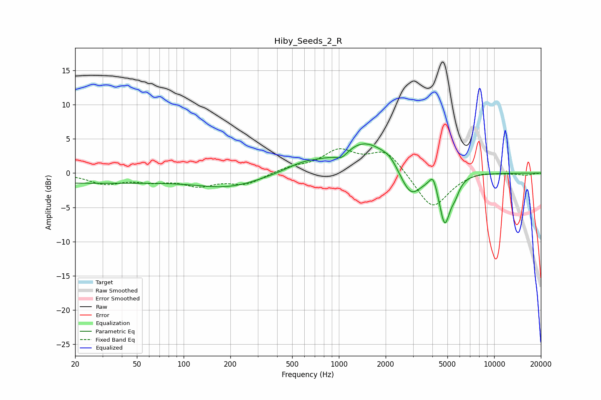

# Hiby_Seeds_2_R
See [usage instructions](https://github.com/jaakkopasanen/AutoEq#usage) for more options and info.

### Parametric EQs
Apply preamp of -4.4 dB when using parametric equalizer.

|   # | Type    |   Fc (Hz) |    Q |   Gain (dB) |
|-----|---------|-----------|------|-------------|
|   1 | Peaking |        20 | 0.2  |        -1.4 |
|   2 | Peaking |       196 | 0.66 |        -1.8 |
|   3 | Peaking |       590 | 1.19 |         1.1 |
|   4 | Peaking |      1045 | 3.56 |        -1.1 |
|   5 | Peaking |      1482 | 0.87 |         4.7 |
|   6 | Peaking |      2130 | 3.03 |         0.8 |
|   7 | Peaking |      2899 | 2    |        -4.3 |
|   8 | Peaking |      4045 | 5.96 |         1.9 |
|   9 | Peaking |      4802 | 3.97 |        -7   |
|  10 | Peaking |      5597 | 4.69 |        -1.6 |

### Fixed Band EQs
When using fixed band (also called graphic) equalizer, apply preamp of **-3.7 dB** (if available) and set gains manually with these parameters.

|   # | Type    |   Fc (Hz) |    Q |   Gain (dB) |
|-----|---------|-----------|------|-------------|
|   1 | Peaking |        31 | 1.41 |        -1.4 |
|   2 | Peaking |        62 | 1.41 |        -0.9 |
|   3 | Peaking |       125 | 1.41 |        -1.6 |
|   4 | Peaking |       250 | 1.41 |        -1.5 |
|   5 | Peaking |       500 | 1.41 |         0.8 |
|   6 | Peaking |      1000 | 1.41 |         3.1 |
|   7 | Peaking |      2000 | 1.41 |         3.3 |
|   8 | Peaking |      4000 | 1.41 |        -5.4 |
|   9 | Peaking |      8000 | 1.41 |         0.4 |
|  10 | Peaking |     16000 | 1.41 |        -0.3 |

### Graphs

