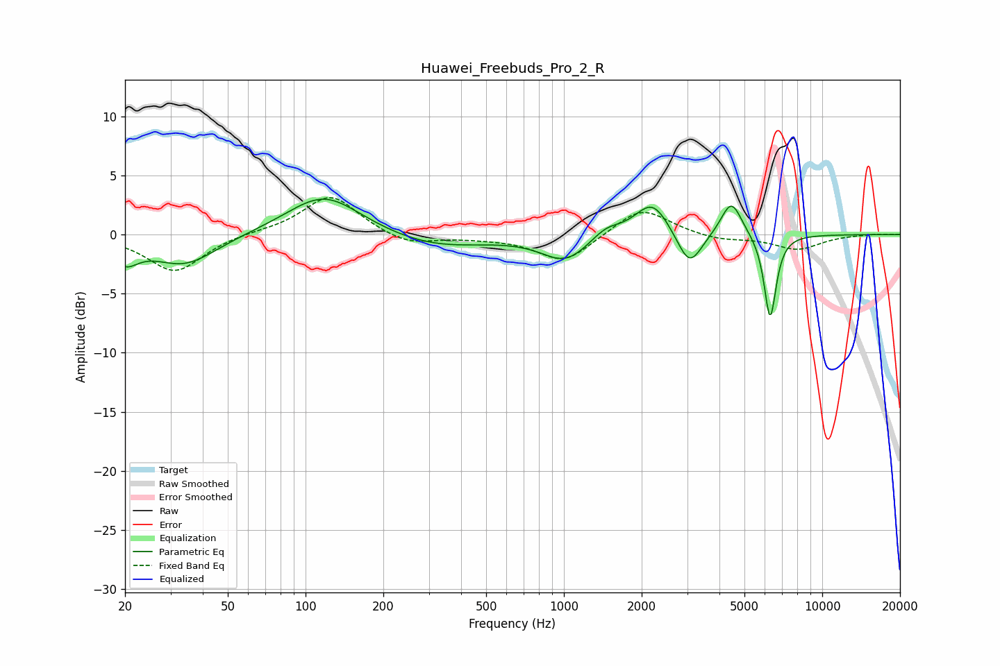

# Huawei_Freebuds_Pro_2_R
See [usage instructions](https://github.com/jaakkopasanen/AutoEq#usage) for more options and info.

### Parametric EQs
Apply preamp of -3.1 dB when using parametric equalizer.

|   # | Type    |   Fc (Hz) |    Q |   Gain (dB) |
|-----|---------|-----------|------|-------------|
|   1 | Peaking |        20 | 2.8  |        -1.8 |
|   2 | Peaking |        34 | 1.13 |        -2.6 |
|   3 | Peaking |       118 | 0.98 |         3.5 |
|   4 | Peaking |       318 | 0.71 |        -1.2 |
|   5 | Peaking |      1014 | 1.54 |        -2.2 |
|   6 | Peaking |      1456 | 2.45 |         1   |
|   7 | Peaking |      2199 | 2.14 |         3   |
|   8 | Peaking |      3062 | 2.93 |        -3.1 |
|   9 | Peaking |      4448 | 3.47 |         3   |
|  10 | Peaking |      6286 | 5.88 |        -7.2 |

### Fixed Band EQs
When using fixed band (also called graphic) equalizer, apply preamp of **-3.2 dB** (if available) and set gains manually with these parameters.

|   # | Type    |   Fc (Hz) |    Q |   Gain (dB) |
|-----|---------|-----------|------|-------------|
|   1 | Peaking |        31 | 1.41 |        -3.2 |
|   2 | Peaking |        62 | 1.41 |         0.2 |
|   3 | Peaking |       125 | 1.41 |         3.4 |
|   4 | Peaking |       250 | 1.41 |        -1   |
|   5 | Peaking |       500 | 1.41 |        -0.2 |
|   6 | Peaking |      1000 | 1.41 |        -2.4 |
|   7 | Peaking |      2000 | 1.41 |         2.4 |
|   8 | Peaking |      4000 | 1.41 |        -0.5 |
|   9 | Peaking |      8000 | 1.41 |        -1.2 |
|  10 | Peaking |     16000 | 1.41 |         0.1 |

### Graphs

