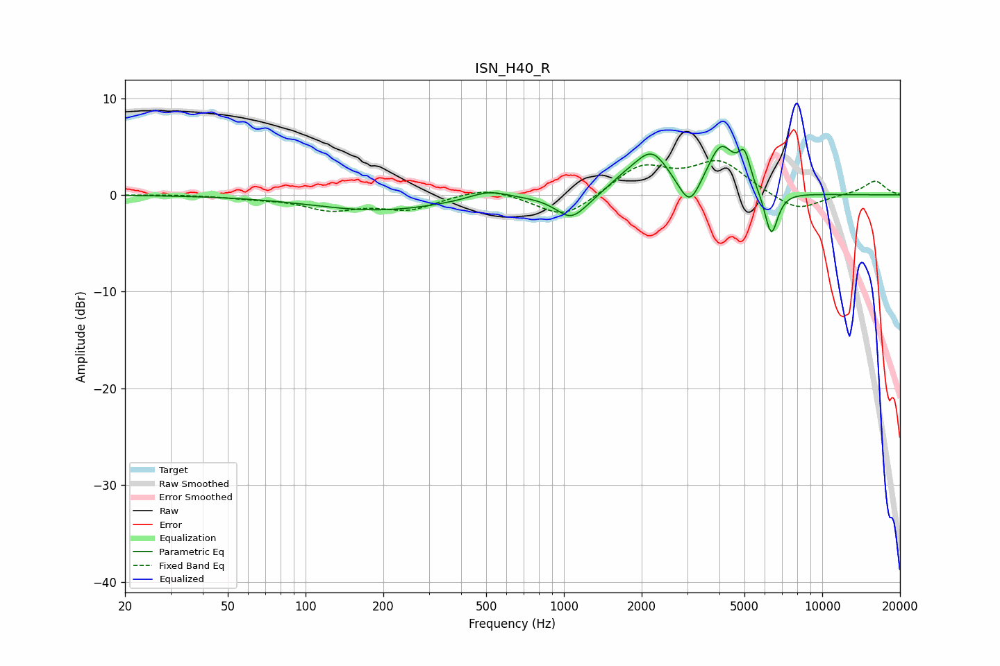

# ISN_H40_R
See [usage instructions](https://github.com/jaakkopasanen/AutoEq#usage) for more options and info.

### Parametric EQs
Apply preamp of -5.1 dB when using parametric equalizer.

|   # | Type    |   Fc (Hz) |    Q |   Gain (dB) |
|-----|---------|-----------|------|-------------|
|   1 | Peaking |       191 | 0.55 |        -1.6 |
|   2 | Peaking |       511 | 1.9  |         0.9 |
|   3 | Peaking |      1063 | 2.42 |        -2.3 |
|   4 | Peaking |      1257 | 1.69 |        -0.5 |
|   5 | Peaking |      1708 | 1.75 |         1.2 |
|   6 | Peaking |      2194 | 2.11 |         3.9 |
|   7 | Peaking |      3067 | 3.44 |        -3   |
|   8 | Peaking |      4056 | 2.64 |         4.9 |
|   9 | Peaking |      5000 | 5.98 |         3.1 |
|  10 | Peaking |      6347 | 5.36 |        -4.7 |

### Fixed Band EQs
When using fixed band (also called graphic) equalizer, apply preamp of **-3.6 dB** (if available) and set gains manually with these parameters.

|   # | Type    |   Fc (Hz) |    Q |   Gain (dB) |
|-----|---------|-----------|------|-------------|
|   1 | Peaking |        31 | 1.41 |         0.1 |
|   2 | Peaking |        62 | 1.41 |        -0.3 |
|   3 | Peaking |       125 | 1.41 |        -1.4 |
|   4 | Peaking |       250 | 1.41 |        -1.4 |
|   5 | Peaking |       500 | 1.41 |         0.9 |
|   6 | Peaking |      1000 | 1.41 |        -2.5 |
|   7 | Peaking |      2000 | 1.41 |         2.9 |
|   8 | Peaking |      4000 | 1.41 |         3.3 |
|   9 | Peaking |      8000 | 1.41 |        -1.8 |
|  10 | Peaking |     16000 | 1.41 |         1.5 |

### Graphs

