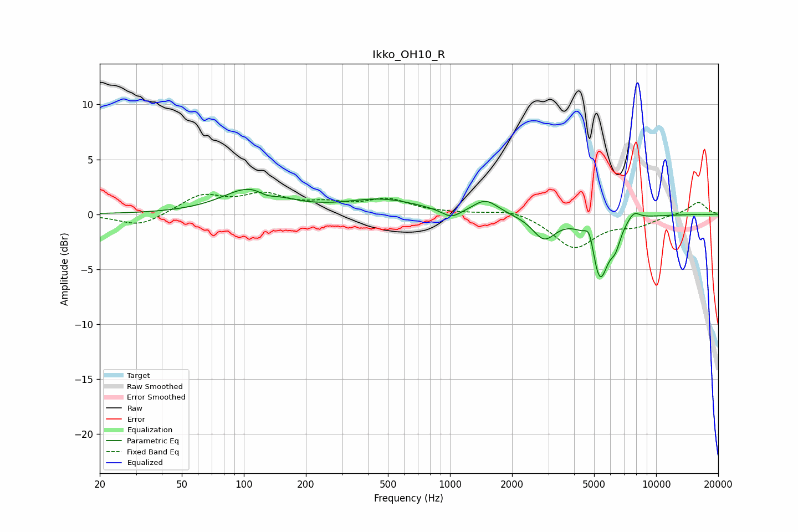

# Ikko_OH10_R
See [usage instructions](https://github.com/jaakkopasanen/AutoEq#usage) for more options and info.

### Parametric EQs
Apply preamp of -2.4 dB when using parametric equalizer.

|   # | Type    |   Fc (Hz) |    Q |   Gain (dB) |
|-----|---------|-----------|------|-------------|
|   1 | Peaking |       109 | 1.04 |         2.4 |
|   2 | Peaking |       129 | 3.1  |        -0.6 |
|   3 | Peaking |       467 | 0.78 |         1.3 |
|   4 | Peaking |      1015 | 3    |        -0.8 |
|   5 | Peaking |      1490 | 2.37 |         1.3 |
|   6 | Peaking |      2861 | 2.53 |        -2.1 |
|   7 | Peaking |      4762 | 6    |         2   |
|   8 | Peaking |      5318 | 3.24 |        -5.9 |
|   9 | Peaking |      6347 | 5.44 |        -1.5 |
|  10 | Peaking |      7789 | 4.36 |         0.8 |

### Fixed Band EQs
When using fixed band (also called graphic) equalizer, apply preamp of **-2.1 dB** (if available) and set gains manually with these parameters.

|   # | Type    |   Fc (Hz) |    Q |   Gain (dB) |
|-----|---------|-----------|------|-------------|
|   1 | Peaking |        31 | 1.41 |        -1.2 |
|   2 | Peaking |        62 | 1.41 |         1.7 |
|   3 | Peaking |       125 | 1.41 |         1.6 |
|   4 | Peaking |       250 | 1.41 |         0.8 |
|   5 | Peaking |       500 | 1.41 |         1.2 |
|   6 | Peaking |      1000 | 1.41 |         0.1 |
|   7 | Peaking |      2000 | 1.41 |         0.5 |
|   8 | Peaking |      4000 | 1.41 |        -3   |
|   9 | Peaking |      8000 | 1.41 |        -0.9 |
|  10 | Peaking |     16000 | 1.41 |         1.1 |

### Graphs

