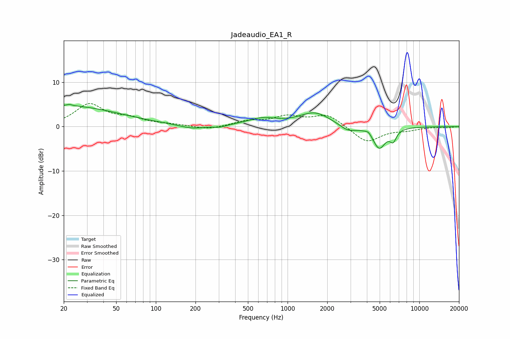

# Jadeaudio_EA1_R
See [usage instructions](https://github.com/jaakkopasanen/AutoEq#usage) for more options and info.

### Parametric EQs
Apply preamp of -5.1 dB when using parametric equalizer.

|   # | Type    |   Fc (Hz) |    Q |   Gain (dB) |
|-----|---------|-----------|------|-------------|
|   1 | Peaking |        20 | 0.34 |         4.6 |
|   2 | Peaking |        22 | 6    |         0.3 |
|   3 | Peaking |       188 | 1.54 |        -0.8 |
|   4 | Peaking |       304 | 2.93 |        -0.5 |
|   5 | Peaking |       638 | 1.21 |         1.6 |
|   6 | Peaking |      1609 | 1.2  |         3.1 |
|   7 | Peaking |      2865 | 2.31 |        -1.4 |
|   8 | Peaking |      4115 | 6    |         0.7 |
|   9 | Peaking |      4957 | 2.87 |        -4.9 |
|  10 | Peaking |      6330 | 5.51 |        -2.3 |

### Fixed Band EQs
When using fixed band (also called graphic) equalizer, apply preamp of **-5.3 dB** (if available) and set gains manually with these parameters.

|   # | Type    |   Fc (Hz) |    Q |   Gain (dB) |
|-----|---------|-----------|------|-------------|
|   1 | Peaking |        31 | 1.41 |         4.9 |
|   2 | Peaking |        62 | 1.41 |         1.6 |
|   3 | Peaking |       125 | 1.41 |         0.4 |
|   4 | Peaking |       250 | 1.41 |        -0.7 |
|   5 | Peaking |       500 | 1.41 |         1.1 |
|   6 | Peaking |      1000 | 1.41 |         2.1 |
|   7 | Peaking |      2000 | 1.41 |         2.7 |
|   8 | Peaking |      4000 | 1.41 |        -3.6 |
|   9 | Peaking |      8000 | 1.41 |        -0.7 |
|  10 | Peaking |     16000 | 1.41 |        -0.2 |

### Graphs

