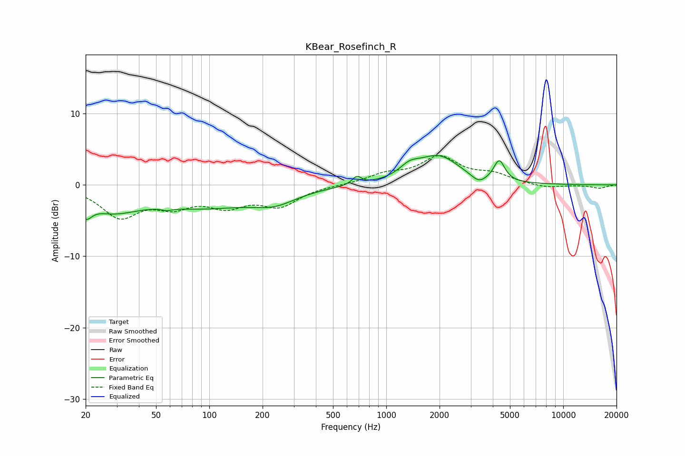

# KBear_Rosefinch_R
See [usage instructions](https://github.com/jaakkopasanen/AutoEq#usage) for more options and info.

### Parametric EQs
Apply preamp of -4.2 dB when using parametric equalizer.

|   # | Type    |   Fc (Hz) |    Q |   Gain (dB) |
|-----|---------|-----------|------|-------------|
|   1 | Peaking |        20 | 4.15 |        -2.3 |
|   2 | Peaking |        28 | 0.96 |        -2.8 |
|   3 | Peaking |        58 | 5.83 |        -0.3 |
|   4 | Peaking |        92 | 0.46 |        -2.9 |
|   5 | Peaking |       235 | 1.17 |        -1.6 |
|   6 | Peaking |       681 | 5.53 |         1.1 |
|   7 | Peaking |      1354 | 2.46 |         1.4 |
|   8 | Peaking |      1977 | 1.19 |         3.9 |
|   9 | Peaking |      3335 | 3.33 |        -1.1 |
|  10 | Peaking |      4349 | 4.59 |         2.9 |

### Fixed Band EQs
When using fixed band (also called graphic) equalizer, apply preamp of **-4.2 dB** (if available) and set gains manually with these parameters.

|   # | Type    |   Fc (Hz) |    Q |   Gain (dB) |
|-----|---------|-----------|------|-------------|
|   1 | Peaking |        31 | 1.41 |        -4.2 |
|   2 | Peaking |        62 | 1.41 |        -2.4 |
|   3 | Peaking |       125 | 1.41 |        -2.5 |
|   4 | Peaking |       250 | 1.41 |        -2.7 |
|   5 | Peaking |       500 | 1.41 |        -0   |
|   6 | Peaking |      1000 | 1.41 |         1.3 |
|   7 | Peaking |      2000 | 1.41 |         3.7 |
|   8 | Peaking |      4000 | 1.41 |         1.3 |
|   9 | Peaking |      8000 | 1.41 |        -0.5 |
|  10 | Peaking |     16000 | 1.41 |        -0.5 |

### Graphs

