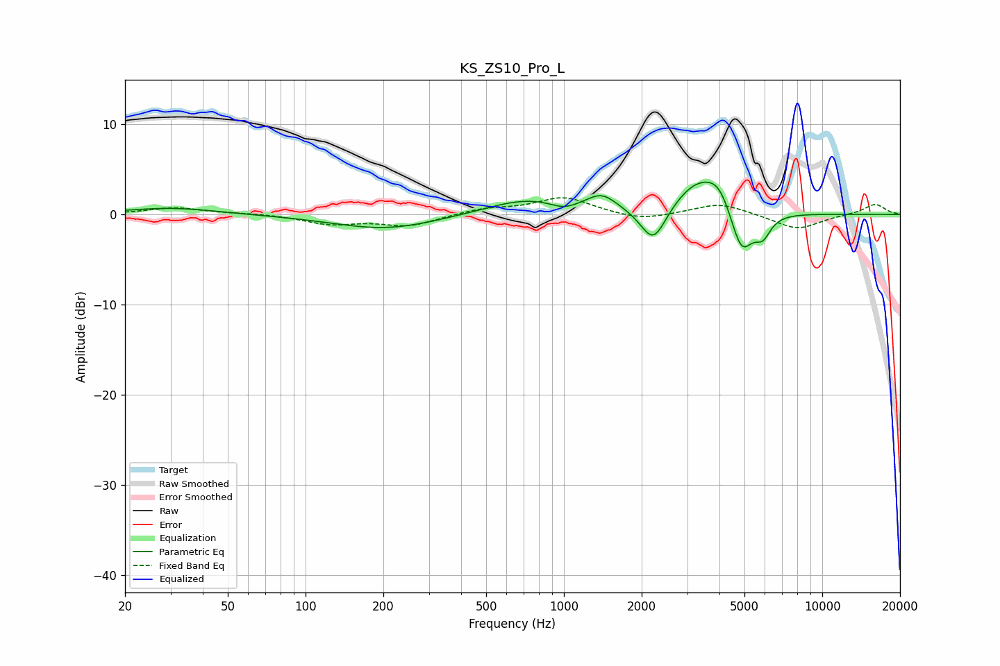

# KS_ZS10_Pro_L
See [usage instructions](https://github.com/jaakkopasanen/AutoEq#usage) for more options and info.

### Parametric EQs
Apply preamp of -3.7 dB when using parametric equalizer.

|   # | Type    |   Fc (Hz) |    Q |   Gain (dB) |
|-----|---------|-----------|------|-------------|
|   1 | Peaking |        30 | 0.82 |         0.7 |
|   2 | Peaking |       205 | 0.69 |        -1.7 |
|   3 | Peaking |       719 | 0.87 |         1.7 |
|   4 | Peaking |      1000 | 2.74 |        -0.7 |
|   5 | Peaking |      1402 | 2.39 |         1.7 |
|   6 | Peaking |      2221 | 2.81 |        -4.2 |
|   7 | Peaking |      3318 | 1.43 |         3.7 |
|   8 | Peaking |      3998 | 2.83 |         2.1 |
|   9 | Peaking |      4867 | 3.15 |        -5.3 |
|  10 | Peaking |      5885 | 4.48 |        -2.1 |

### Fixed Band EQs
When using fixed band (also called graphic) equalizer, apply preamp of **-1.9 dB** (if available) and set gains manually with these parameters.

|   # | Type    |   Fc (Hz) |    Q |   Gain (dB) |
|-----|---------|-----------|------|-------------|
|   1 | Peaking |        31 | 1.41 |         0.7 |
|   2 | Peaking |        62 | 1.41 |         0.1 |
|   3 | Peaking |       125 | 1.41 |        -1   |
|   4 | Peaking |       250 | 1.41 |        -1.2 |
|   5 | Peaking |       500 | 1.41 |         0.6 |
|   6 | Peaking |      1000 | 1.41 |         1.9 |
|   7 | Peaking |      2000 | 1.41 |        -0.7 |
|   8 | Peaking |      4000 | 1.41 |         1.3 |
|   9 | Peaking |      8000 | 1.41 |        -1.7 |
|  10 | Peaking |     16000 | 1.41 |         1.2 |

### Graphs

