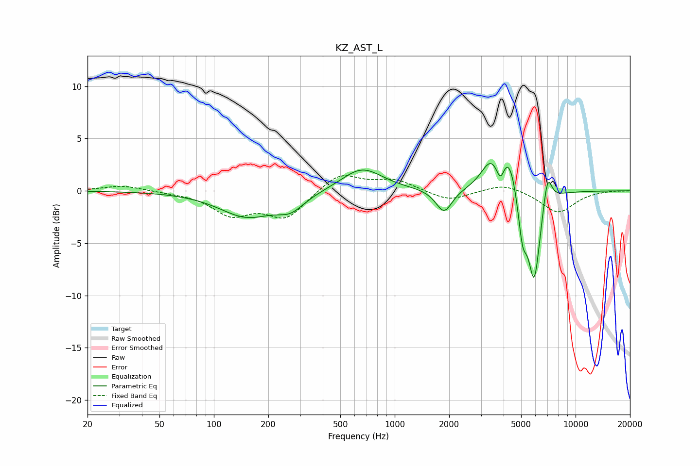

# KZ_AST_L
See [usage instructions](https://github.com/jaakkopasanen/AutoEq#usage) for more options and info.

### Parametric EQs
Apply preamp of -2.7 dB when using parametric equalizer.

|   # | Type    |   Fc (Hz) |    Q |   Gain (dB) |
|-----|---------|-----------|------|-------------|
|   1 | Peaking |       152 | 0.93 |        -2.4 |
|   2 | Peaking |       266 | 1.89 |        -1.3 |
|   3 | Peaking |       658 | 1.25 |         2.2 |
|   4 | Peaking |      1874 | 3.14 |        -2.3 |
|   5 | Peaking |      3379 | 2.66 |         2.3 |
|   6 | Peaking |      3848 | 6    |        -2.1 |
|   7 | Peaking |      4250 | 2.63 |         3.9 |
|   8 | Peaking |      5087 | 5.46 |        -4.4 |
|   9 | Peaking |      5907 | 4.08 |        -8.7 |
|  10 | Peaking |      6999 | 5.81 |         3   |

### Fixed Band EQs
When using fixed band (also called graphic) equalizer, apply preamp of **-1.5 dB** (if available) and set gains manually with these parameters.

|   # | Type    |   Fc (Hz) |    Q |   Gain (dB) |
|-----|---------|-----------|------|-------------|
|   1 | Peaking |        31 | 1.41 |         0.5 |
|   2 | Peaking |        62 | 1.41 |        -0.1 |
|   3 | Peaking |       125 | 1.41 |        -2.1 |
|   4 | Peaking |       250 | 1.41 |        -2.5 |
|   5 | Peaking |       500 | 1.41 |         1.8 |
|   6 | Peaking |      1000 | 1.41 |         1   |
|   7 | Peaking |      2000 | 1.41 |        -1   |
|   8 | Peaking |      4000 | 1.41 |         0.8 |
|   9 | Peaking |      8000 | 1.41 |        -2.1 |
|  10 | Peaking |     16000 | 1.41 |         0   |

### Graphs

