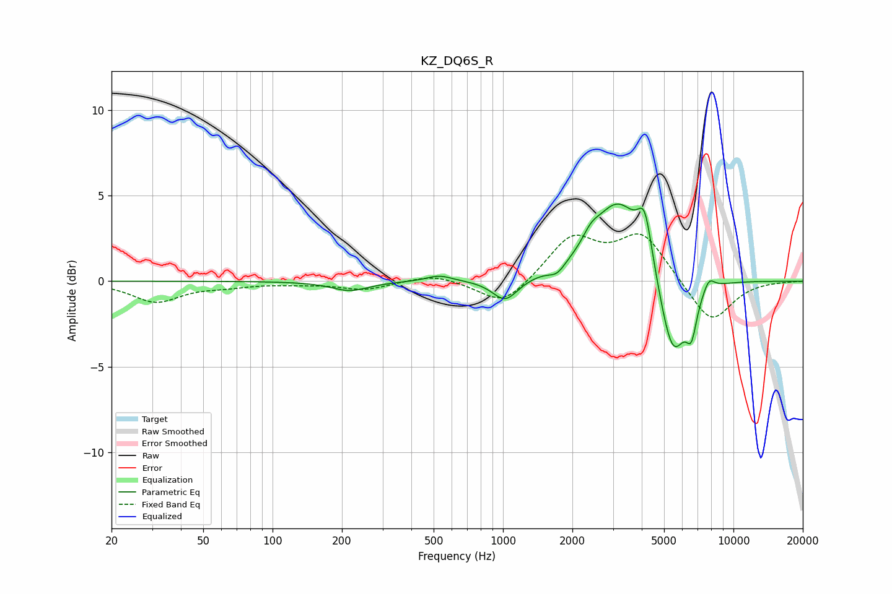

# KZ_DQ6S_R
See [usage instructions](https://github.com/jaakkopasanen/AutoEq#usage) for more options and info.

### Parametric EQs
Apply preamp of -4.6 dB when using parametric equalizer.

|   # | Type    |   Fc (Hz) |    Q |   Gain (dB) |
|-----|---------|-----------|------|-------------|
|   1 | Peaking |       217 | 1.75 |        -0.6 |
|   2 | Peaking |       529 | 2.56 |         0.4 |
|   3 | Peaking |      1023 | 2.54 |        -1.3 |
|   4 | Peaking |      1715 | 4.02 |        -0.5 |
|   5 | Peaking |      2408 | 3.84 |         0.7 |
|   6 | Peaking |      3162 | 1.31 |         4.7 |
|   7 | Peaking |      4127 | 4.52 |         2.7 |
|   8 | Peaking |      5456 | 2.34 |        -5.1 |
|   9 | Peaking |      6575 | 5.97 |        -2   |
|  10 | Peaking |      7828 | 5.42 |         0.7 |

### Fixed Band EQs
When using fixed band (also called graphic) equalizer, apply preamp of **-2.9 dB** (if available) and set gains manually with these parameters.

|   # | Type    |   Fc (Hz) |    Q |   Gain (dB) |
|-----|---------|-----------|------|-------------|
|   1 | Peaking |        31 | 1.41 |        -1.2 |
|   2 | Peaking |        62 | 1.41 |        -0.2 |
|   3 | Peaking |       125 | 1.41 |        -0.1 |
|   4 | Peaking |       250 | 1.41 |        -0.5 |
|   5 | Peaking |       500 | 1.41 |         0.4 |
|   6 | Peaking |      1000 | 1.41 |        -1.5 |
|   7 | Peaking |      2000 | 1.41 |         2.5 |
|   8 | Peaking |      4000 | 1.41 |         2.7 |
|   9 | Peaking |      8000 | 1.41 |        -2.5 |
|  10 | Peaking |     16000 | 1.41 |        -0   |

### Graphs

