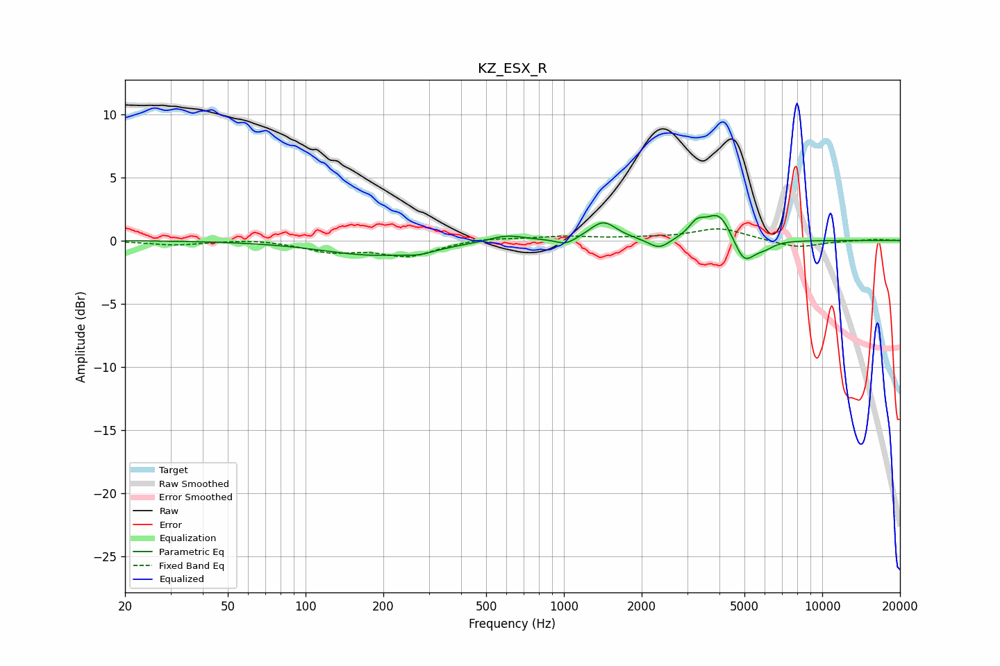

# KZ_ESX_R
See [usage instructions](https://github.com/jaakkopasanen/AutoEq#usage) for more options and info.

### Parametric EQs
Apply preamp of -2.1 dB when using parametric equalizer.

|   # | Type    |   Fc (Hz) |    Q |   Gain (dB) |
|-----|---------|-----------|------|-------------|
|   1 | Peaking |       185 | 0.69 |        -1.1 |
|   2 | Peaking |       276 | 2.68 |        -0.3 |
|   3 | Peaking |       597 | 1.99 |         0.5 |
|   4 | Peaking |      1018 | 3.74 |        -0.5 |
|   5 | Peaking |      1419 | 2.7  |         1.5 |
|   6 | Peaking |      2338 | 3.43 |        -0.9 |
|   7 | Peaking |      3273 | 4.48 |         1   |
|   8 | Peaking |      3992 | 2.74 |         2.3 |
|   9 | Peaking |      4980 | 3.37 |        -2.1 |
|  10 | Peaking |      5985 | 3.78 |        -0.4 |

### Fixed Band EQs
When using fixed band (also called graphic) equalizer, apply preamp of **-1.0 dB** (if available) and set gains manually with these parameters.

|   # | Type    |   Fc (Hz) |    Q |   Gain (dB) |
|-----|---------|-----------|------|-------------|
|   1 | Peaking |        31 | 1.41 |        -0.3 |
|   2 | Peaking |        62 | 1.41 |         0.2 |
|   3 | Peaking |       125 | 1.41 |        -0.8 |
|   4 | Peaking |       250 | 1.41 |        -1.2 |
|   5 | Peaking |       500 | 1.41 |         0.2 |
|   6 | Peaking |      1000 | 1.41 |         0.3 |
|   7 | Peaking |      2000 | 1.41 |         0.1 |
|   8 | Peaking |      4000 | 1.41 |         1   |
|   9 | Peaking |      8000 | 1.41 |        -0.6 |
|  10 | Peaking |     16000 | 1.41 |         0.1 |

### Graphs

