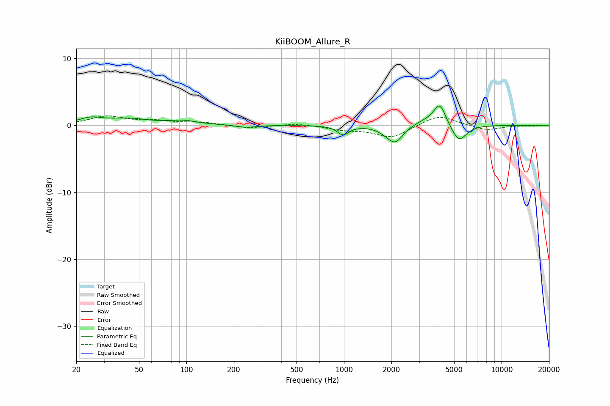

# KiiBOOM_Allure_R
See [usage instructions](https://github.com/jaakkopasanen/AutoEq#usage) for more options and info.

### Parametric EQs
Apply preamp of -3.0 dB when using parametric equalizer.

|   # | Type    |   Fc (Hz) |    Q |   Gain (dB) |
|-----|---------|-----------|------|-------------|
|   1 | Peaking |        25 | 1.92 |         0.9 |
|   2 | Peaking |        43 | 1.08 |         0.9 |
|   3 | Peaking |        95 | 1.63 |         0.6 |
|   4 | Peaking |       240 | 2.5  |        -0.4 |
|   5 | Peaking |       987 | 3.99 |        -1.3 |
|   6 | Peaking |      1851 | 2.72 |        -0.4 |
|   7 | Peaking |      2118 | 2.86 |        -2.5 |
|   8 | Peaking |      3496 | 1.39 |         0.9 |
|   9 | Peaking |      4056 | 3.78 |         2.9 |
|  10 | Peaking |      5352 | 2.92 |        -2.7 |

### Fixed Band EQs
When using fixed band (also called graphic) equalizer, apply preamp of **-1.5 dB** (if available) and set gains manually with these parameters.

|   # | Type    |   Fc (Hz) |    Q |   Gain (dB) |
|-----|---------|-----------|------|-------------|
|   1 | Peaking |        31 | 1.41 |         1.3 |
|   2 | Peaking |        62 | 1.41 |         0.6 |
|   3 | Peaking |       125 | 1.41 |         0.4 |
|   4 | Peaking |       250 | 1.41 |        -0.5 |
|   5 | Peaking |       500 | 1.41 |         0.3 |
|   6 | Peaking |      1000 | 1.41 |        -0.6 |
|   7 | Peaking |      2000 | 1.41 |        -1.8 |
|   8 | Peaking |      4000 | 1.41 |         1.6 |
|   9 | Peaking |      8000 | 1.41 |        -0.8 |
|  10 | Peaking |     16000 | 1.41 |        -0.1 |

### Graphs

