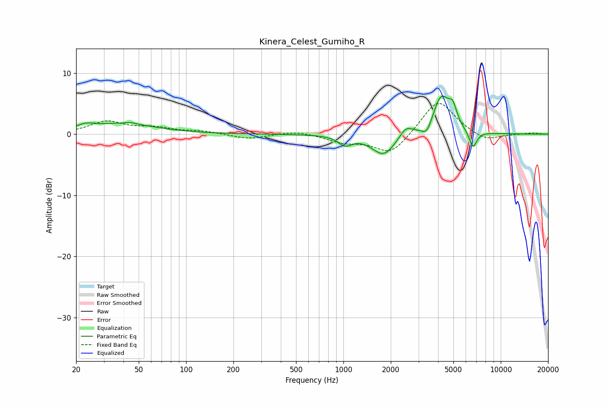

# Kinera_Celest_Gumiho_R
See [usage instructions](https://github.com/jaakkopasanen/AutoEq#usage) for more options and info.

### Parametric EQs
Apply preamp of -6.3 dB when using parametric equalizer.

|   # | Type    |   Fc (Hz) |    Q |   Gain (dB) |
|-----|---------|-----------|------|-------------|
|   1 | Peaking |        23 | 2.5  |         0.8 |
|   2 | Peaking |        40 | 0.7  |         1.7 |
|   3 | Peaking |        44 | 5.15 |         0.2 |
|   4 | Peaking |      1026 | 3.28 |        -1.5 |
|   5 | Peaking |      1802 | 1.9  |        -3.5 |
|   6 | Peaking |      2499 | 3.48 |         1.6 |
|   7 | Peaking |      3391 | 4.57 |        -1.9 |
|   8 | Peaking |      4190 | 2.55 |         6.2 |
|   9 | Peaking |      4957 | 5.45 |         2.6 |
|  10 | Peaking |      6658 | 5.58 |        -2.8 |

### Fixed Band EQs
When using fixed band (also called graphic) equalizer, apply preamp of **-5.1 dB** (if available) and set gains manually with these parameters.

|   # | Type    |   Fc (Hz) |    Q |   Gain (dB) |
|-----|---------|-----------|------|-------------|
|   1 | Peaking |        31 | 1.41 |         2   |
|   2 | Peaking |        62 | 1.41 |         0.9 |
|   3 | Peaking |       125 | 1.41 |         0.4 |
|   4 | Peaking |       250 | 1.41 |        -0.8 |
|   5 | Peaking |       500 | 1.41 |         0.6 |
|   6 | Peaking |      1000 | 1.41 |        -1.2 |
|   7 | Peaking |      2000 | 1.41 |        -3.4 |
|   8 | Peaking |      4000 | 1.41 |         5.8 |
|   9 | Peaking |      8000 | 1.41 |        -1.3 |
|  10 | Peaking |     16000 | 1.41 |         0.2 |

### Graphs

