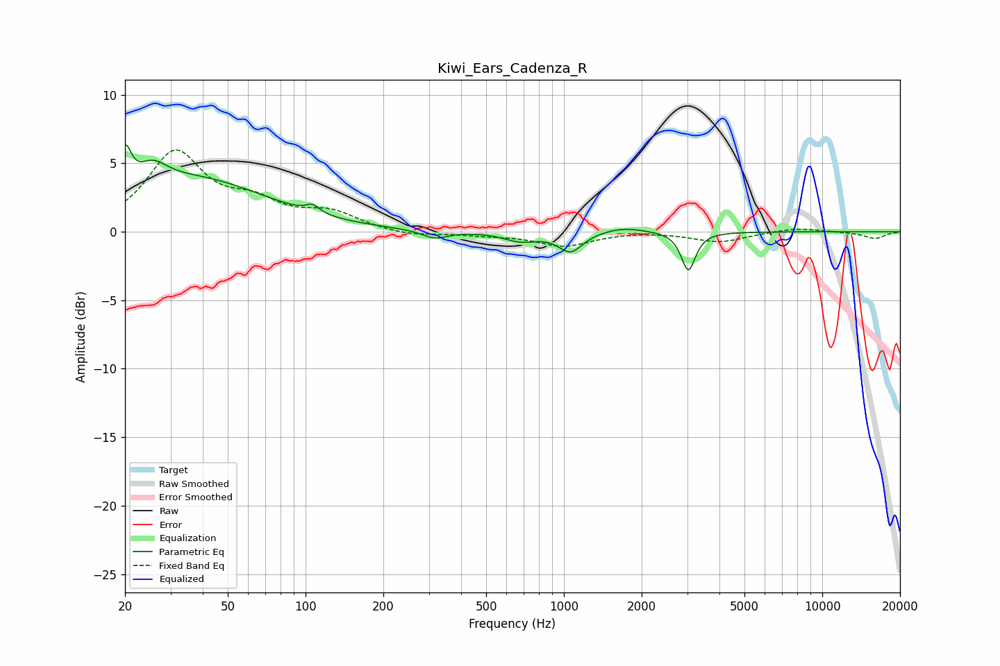

# Kiwi_Ears_Cadenza_R
See [usage instructions](https://github.com/jaakkopasanen/AutoEq#usage) for more options and info.

### Parametric EQs
Apply preamp of -6.4 dB when using parametric equalizer.

|   # | Type    |   Fc (Hz) |    Q |   Gain (dB) |
|-----|---------|-----------|------|-------------|
|   1 | Peaking |        20 | 6    |         3.1 |
|   2 | Peaking |        25 | 2.36 |         1.7 |
|   3 | Peaking |        38 | 0.51 |         3.7 |
|   4 | Peaking |       107 | 5.57 |         0.6 |
|   5 | Peaking |       317 | 2.82 |        -0.6 |
|   6 | Peaking |       679 | 2.21 |        -0.6 |
|   7 | Peaking |      1061 | 3.07 |        -1.4 |
|   8 | Peaking |      1699 | 1.72 |         0.4 |
|   9 | Peaking |      3032 | 5.38 |        -2.8 |
|  10 | Peaking |      9901 | 5.06 |         0   |

### Fixed Band EQs
When using fixed band (also called graphic) equalizer, apply preamp of **-6.1 dB** (if available) and set gains manually with these parameters.

|   # | Type    |   Fc (Hz) |    Q |   Gain (dB) |
|-----|---------|-----------|------|-------------|
|   1 | Peaking |        31 | 1.41 |         5.6 |
|   2 | Peaking |        62 | 1.41 |         1.7 |
|   3 | Peaking |       125 | 1.41 |         1.2 |
|   4 | Peaking |       250 | 1.41 |        -0.3 |
|   5 | Peaking |       500 | 1.41 |        -0.2 |
|   6 | Peaking |      1000 | 1.41 |        -1   |
|   7 | Peaking |      2000 | 1.41 |         0.1 |
|   8 | Peaking |      4000 | 1.41 |        -0.7 |
|   9 | Peaking |      8000 | 1.41 |         0.3 |
|  10 | Peaking |     16000 | 1.41 |        -0.5 |

### Graphs

