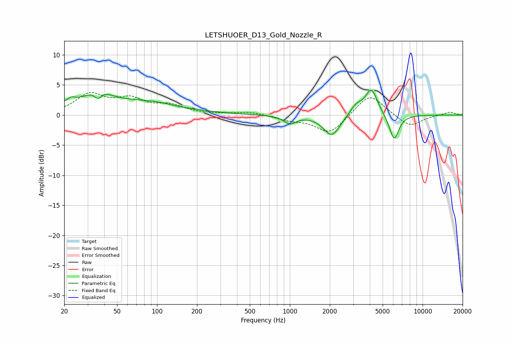

# LETSHUOER_D13_Gold_Nozzle_R
See [usage instructions](https://github.com/jaakkopasanen/AutoEq#usage) for more options and info.

### Parametric EQs
Apply preamp of -4.2 dB when using parametric equalizer.

|   # | Type    |   Fc (Hz) |    Q |   Gain (dB) |
|-----|---------|-----------|------|-------------|
|   1 | Peaking |        23 | 5.83 |         0.6 |
|   2 | Peaking |        36 | 4.13 |        -2.4 |
|   3 | Peaking |        36 | 2.16 |         2.7 |
|   4 | Peaking |        43 | 0.29 |         2.4 |
|   5 | Peaking |        96 | 1.41 |         0.3 |
|   6 | Peaking |      1000 | 3.11 |        -1.3 |
|   7 | Peaking |      2070 | 2.27 |        -3.5 |
|   8 | Peaking |      3159 | 2.89 |         1.6 |
|   9 | Peaking |      4117 | 3.07 |         4.3 |
|  10 | Peaking |      6094 | 3.79 |        -4.3 |

### Fixed Band EQs
When using fixed band (also called graphic) equalizer, apply preamp of **-3.9 dB** (if available) and set gains manually with these parameters.

|   # | Type    |   Fc (Hz) |    Q |   Gain (dB) |
|-----|---------|-----------|------|-------------|
|   1 | Peaking |        31 | 1.41 |         3.3 |
|   2 | Peaking |        62 | 1.41 |         2.3 |
|   3 | Peaking |       125 | 1.41 |         1.4 |
|   4 | Peaking |       250 | 1.41 |         0.1 |
|   5 | Peaking |       500 | 1.41 |         0.5 |
|   6 | Peaking |      1000 | 1.41 |        -0.7 |
|   7 | Peaking |      2000 | 1.41 |        -3.1 |
|   8 | Peaking |      4000 | 1.41 |         3.7 |
|   9 | Peaking |      8000 | 1.41 |        -2   |
|  10 | Peaking |     16000 | 1.41 |         0.5 |

### Graphs

