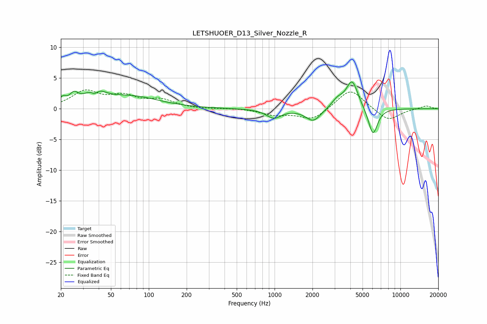

# LETSHUOER_D13_Silver_Nozzle_R
See [usage instructions](https://github.com/jaakkopasanen/AutoEq#usage) for more options and info.

### Parametric EQs
Apply preamp of -4.5 dB when using parametric equalizer.

|   # | Type    |   Fc (Hz) |    Q |   Gain (dB) |
|-----|---------|-----------|------|-------------|
|   1 | Peaking |        21 | 5.85 |         1.1 |
|   2 | Peaking |        25 | 4.13 |         1.5 |
|   3 | Peaking |        37 | 4.48 |        -1.5 |
|   4 | Peaking |        37 | 2.16 |         2.9 |
|   5 | Peaking |        73 | 0.66 |         1.9 |
|   6 | Peaking |       985 | 2.39 |        -1.5 |
|   7 | Peaking |      2030 | 2.35 |        -2.1 |
|   8 | Peaking |      3157 | 2.97 |         1.3 |
|   9 | Peaking |      4132 | 2.99 |         4.6 |
|  10 | Peaking |      6048 | 3.75 |        -4.5 |

### Fixed Band EQs
When using fixed band (also called graphic) equalizer, apply preamp of **-3.2 dB** (if available) and set gains manually with these parameters.

|   # | Type    |   Fc (Hz) |    Q |   Gain (dB) |
|-----|---------|-----------|------|-------------|
|   1 | Peaking |        31 | 1.41 |         2.7 |
|   2 | Peaking |        62 | 1.41 |         1.8 |
|   3 | Peaking |       125 | 1.41 |         1.3 |
|   4 | Peaking |       250 | 1.41 |        -0.1 |
|   5 | Peaking |       500 | 1.41 |         0.1 |
|   6 | Peaking |      1000 | 1.41 |        -0.9 |
|   7 | Peaking |      2000 | 1.41 |        -1.8 |
|   8 | Peaking |      4000 | 1.41 |         3.3 |
|   9 | Peaking |      8000 | 1.41 |        -2   |
|  10 | Peaking |     16000 | 1.41 |         0.5 |

### Graphs

