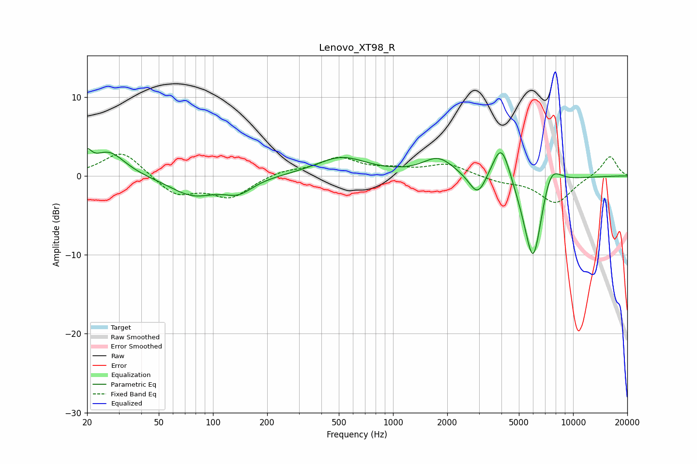

# Lenovo_XT98_R
See [usage instructions](https://github.com/jaakkopasanen/AutoEq#usage) for more options and info.

### Parametric EQs
Apply preamp of -3.5 dB when using parametric equalizer.

|   # | Type    |   Fc (Hz) |    Q |   Gain (dB) |
|-----|---------|-----------|------|-------------|
|   1 | Peaking |        20 | 5.98 |         1.8 |
|   2 | Peaking |        26 | 1.57 |         3.1 |
|   3 | Peaking |        77 | 1.09 |        -2.4 |
|   4 | Peaking |       138 | 1.74 |        -1.8 |
|   5 | Peaking |       517 | 1    |         2.3 |
|   6 | Peaking |      1785 | 1.64 |         2.3 |
|   7 | Peaking |      2957 | 2.96 |        -3   |
|   8 | Peaking |      3998 | 2.69 |         5.4 |
|   9 | Peaking |      6004 | 2.42 |       -12.4 |
|  10 | Peaking |      7449 | 2.33 |         4.2 |

### Fixed Band EQs
When using fixed band (also called graphic) equalizer, apply preamp of **-2.8 dB** (if available) and set gains manually with these parameters.

|   # | Type    |   Fc (Hz) |    Q |   Gain (dB) |
|-----|---------|-----------|------|-------------|
|   1 | Peaking |        31 | 1.41 |         3.3 |
|   2 | Peaking |        62 | 1.41 |        -2.4 |
|   3 | Peaking |       125 | 1.41 |        -2.6 |
|   4 | Peaking |       250 | 1.41 |         0.7 |
|   5 | Peaking |       500 | 1.41 |         2.2 |
|   6 | Peaking |      1000 | 1.41 |         0.7 |
|   7 | Peaking |      2000 | 1.41 |         1.5 |
|   8 | Peaking |      4000 | 1.41 |        -0.7 |
|   9 | Peaking |      8000 | 1.41 |        -3.4 |
|  10 | Peaking |     16000 | 1.41 |         2.6 |

### Graphs

