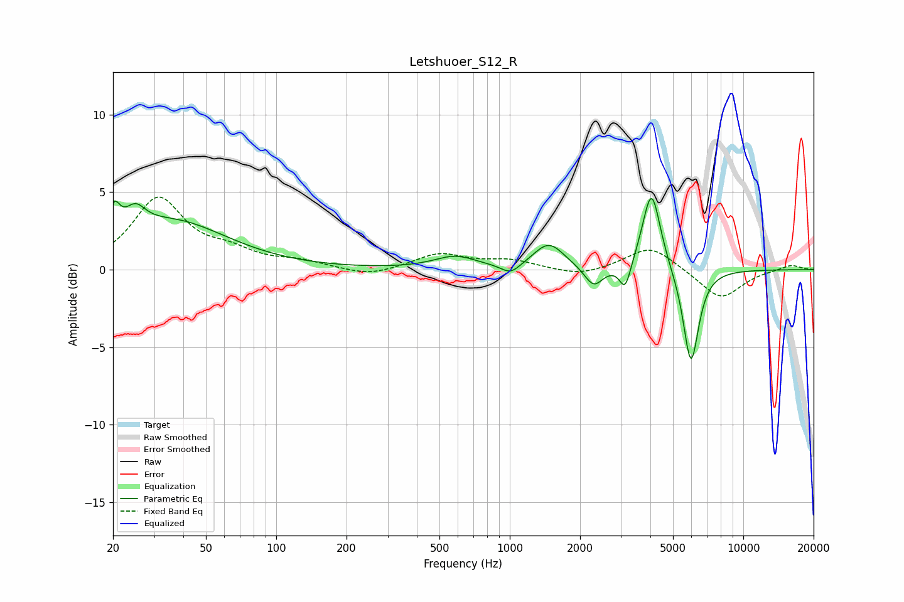

# Letshuoer_S12_R
See [usage instructions](https://github.com/jaakkopasanen/AutoEq#usage) for more options and info.

### Parametric EQs
Apply preamp of -4.7 dB when using parametric equalizer.

|   # | Type    |   Fc (Hz) |    Q |   Gain (dB) |
|-----|---------|-----------|------|-------------|
|   1 | Peaking |        20 | 5.67 |         1.9 |
|   2 | Peaking |        25 | 3.29 |         1.4 |
|   3 | Peaking |        36 | 0.6  |         3.1 |
|   4 | Peaking |       583 | 1.57 |         0.8 |
|   5 | Peaking |      1009 | 3.36 |        -0.7 |
|   6 | Peaking |      1471 | 2.16 |         1.7 |
|   7 | Peaking |      2288 | 3.54 |        -1.3 |
|   8 | Peaking |      3123 | 5.82 |        -1.8 |
|   9 | Peaking |      4045 | 3.63 |         5.2 |
|  10 | Peaking |      5969 | 4.14 |        -6.2 |

### Fixed Band EQs
When using fixed band (also called graphic) equalizer, apply preamp of **-4.8 dB** (if available) and set gains manually with these parameters.

|   # | Type    |   Fc (Hz) |    Q |   Gain (dB) |
|-----|---------|-----------|------|-------------|
|   1 | Peaking |        31 | 1.41 |         4.5 |
|   2 | Peaking |        62 | 1.41 |         0.9 |
|   3 | Peaking |       125 | 1.41 |         0.4 |
|   4 | Peaking |       250 | 1.41 |        -0.5 |
|   5 | Peaking |       500 | 1.41 |         1   |
|   6 | Peaking |      1000 | 1.41 |         0.5 |
|   7 | Peaking |      2000 | 1.41 |        -0.5 |
|   8 | Peaking |      4000 | 1.41 |         1.6 |
|   9 | Peaking |      8000 | 1.41 |        -1.9 |
|  10 | Peaking |     16000 | 1.41 |         0.3 |

### Graphs

