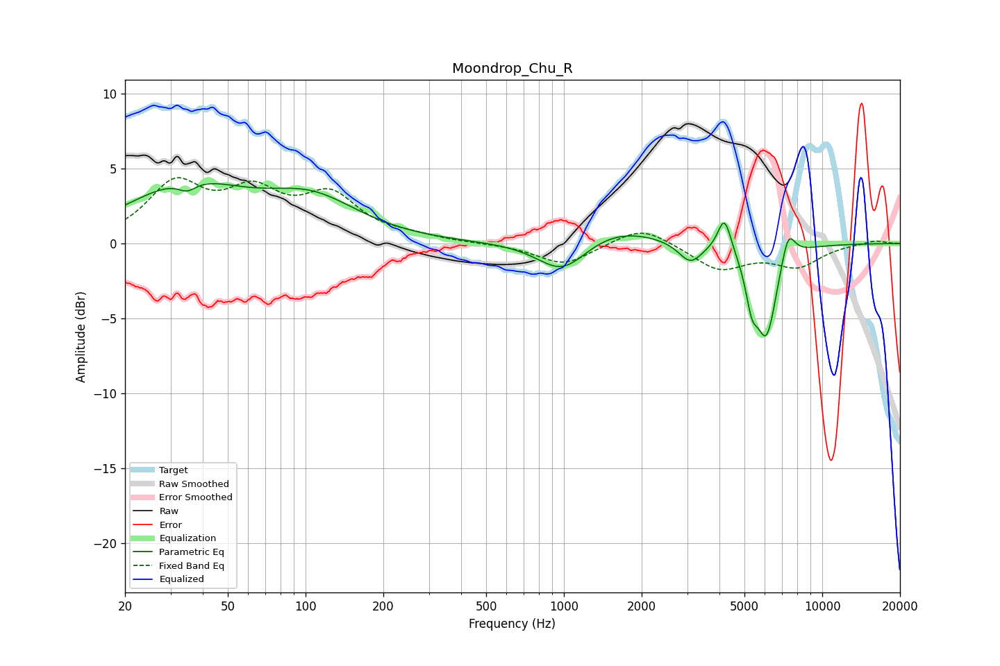

# Moondrop_Chu_R
See [usage instructions](https://github.com/jaakkopasanen/AutoEq#usage) for more options and info.

### Parametric EQs
Apply preamp of -4.1 dB when using parametric equalizer.

|   # | Type    |   Fc (Hz) |    Q |   Gain (dB) |
|-----|---------|-----------|------|-------------|
|   1 | Peaking |        34 | 0.63 |         3.7 |
|   2 | Peaking |        35 | 4.03 |        -0.7 |
|   3 | Peaking |       106 | 0.77 |         2.6 |
|   4 | Peaking |       988 | 1.45 |        -2.3 |
|   5 | Peaking |      1573 | 0.85 |         1.2 |
|   6 | Peaking |      3088 | 3.09 |        -1.4 |
|   7 | Peaking |      4184 | 5.42 |         2.4 |
|   8 | Peaking |      5334 | 5.98 |        -2.4 |
|   9 | Peaking |      6081 | 3.3  |        -6   |
|  10 | Peaking |      7377 | 4.9  |         2.1 |

### Fixed Band EQs
When using fixed band (also called graphic) equalizer, apply preamp of **-4.5 dB** (if available) and set gains manually with these parameters.

|   # | Type    |   Fc (Hz) |    Q |   Gain (dB) |
|-----|---------|-----------|------|-------------|
|   1 | Peaking |        31 | 1.41 |         3.7 |
|   2 | Peaking |        62 | 1.41 |         2.9 |
|   3 | Peaking |       125 | 1.41 |         2.9 |
|   4 | Peaking |       250 | 1.41 |         0.3 |
|   5 | Peaking |       500 | 1.41 |        -0   |
|   6 | Peaking |      1000 | 1.41 |        -1.4 |
|   7 | Peaking |      2000 | 1.41 |         1.3 |
|   8 | Peaking |      4000 | 1.41 |        -1.7 |
|   9 | Peaking |      8000 | 1.41 |        -1.4 |
|  10 | Peaking |     16000 | 1.41 |         0.2 |

### Graphs

