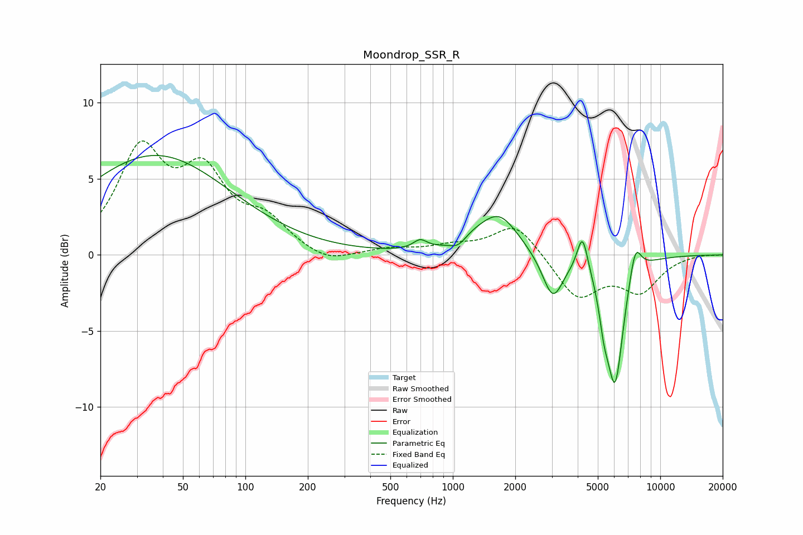

# Moondrop_SSR_R
See [usage instructions](https://github.com/jaakkopasanen/AutoEq#usage) for more options and info.

### Parametric EQs
Apply preamp of -6.6 dB when using parametric equalizer.

|   # | Type    |   Fc (Hz) |    Q |   Gain (dB) |
|-----|---------|-----------|------|-------------|
|   1 | Peaking |        37 | 0.39 |         6.5 |
|   2 | Peaking |       696 | 4.29 |         0.6 |
|   3 | Peaking |      1065 | 3.45 |        -0.6 |
|   4 | Peaking |      1223 | 1.68 |         0.6 |
|   5 | Peaking |      1679 | 1.53 |         2.5 |
|   6 | Peaking |      3035 | 2.81 |        -2.9 |
|   7 | Peaking |      4217 | 5.5  |         2.4 |
|   8 | Peaking |      5351 | 5.96 |        -1.9 |
|   9 | Peaking |      6054 | 3.39 |        -8.2 |
|  10 | Peaking |      7582 | 4.72 |         2.1 |

### Fixed Band EQs
When using fixed band (also called graphic) equalizer, apply preamp of **-7.6 dB** (if available) and set gains manually with these parameters.

|   # | Type    |   Fc (Hz) |    Q |   Gain (dB) |
|-----|---------|-----------|------|-------------|
|   1 | Peaking |        31 | 1.41 |         6.5 |
|   2 | Peaking |        62 | 1.41 |         4.8 |
|   3 | Peaking |       125 | 1.41 |         1.9 |
|   4 | Peaking |       250 | 1.41 |        -0.7 |
|   5 | Peaking |       500 | 1.41 |         0.4 |
|   6 | Peaking |      1000 | 1.41 |         0.5 |
|   7 | Peaking |      2000 | 1.41 |         2.1 |
|   8 | Peaking |      4000 | 1.41 |        -2.8 |
|   9 | Peaking |      8000 | 1.41 |        -2.2 |
|  10 | Peaking |     16000 | 1.41 |         0.1 |

### Graphs

