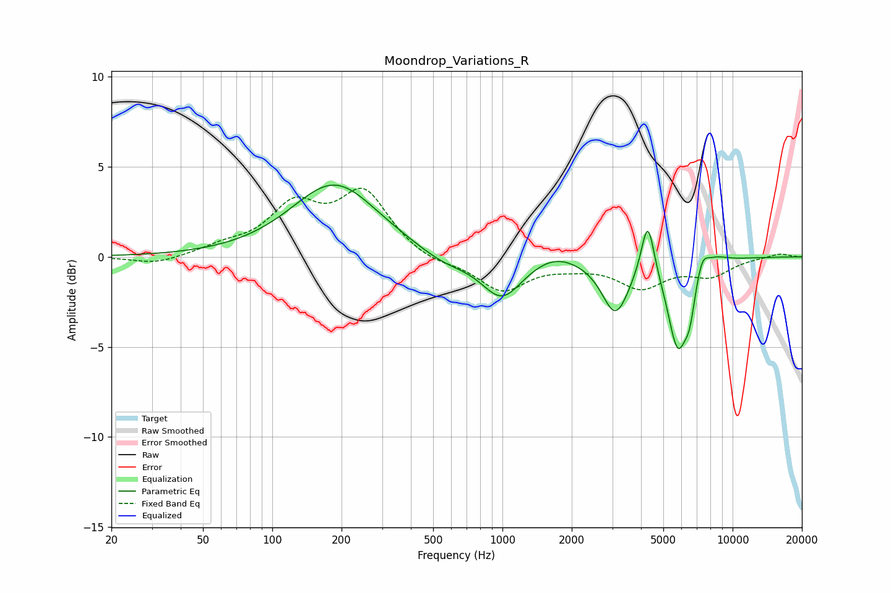

# Moondrop_Variations_R
See [usage instructions](https://github.com/jaakkopasanen/AutoEq#usage) for more options and info.

### Parametric EQs
Apply preamp of -4.1 dB when using parametric equalizer.

|   # | Type    |   Fc (Hz) |    Q |   Gain (dB) |
|-----|---------|-----------|------|-------------|
|   1 | Peaking |       187 | 0.76 |         4.1 |
|   2 | Peaking |       557 | 1.26 |        -0.6 |
|   3 | Peaking |       994 | 1.61 |        -2.3 |
|   4 | Peaking |      1684 | 1.48 |         0.5 |
|   5 | Peaking |      3100 | 2.39 |        -3   |
|   6 | Peaking |      4279 | 4.97 |         3.2 |
|   7 | Peaking |      5784 | 3.1  |        -4.9 |
|   8 | Peaking |      6519 | 6    |        -1.5 |
|   9 | Peaking |      7380 | 4.99 |         1   |
|  10 | Peaking |      8420 | 2.46 |         0.4 |

### Fixed Band EQs
When using fixed band (also called graphic) equalizer, apply preamp of **-3.9 dB** (if available) and set gains manually with these parameters.

|   # | Type    |   Fc (Hz) |    Q |   Gain (dB) |
|-----|---------|-----------|------|-------------|
|   1 | Peaking |        31 | 1.41 |        -0.4 |
|   2 | Peaking |        62 | 1.41 |         0.5 |
|   3 | Peaking |       125 | 1.41 |         2.6 |
|   4 | Peaking |       250 | 1.41 |         3.4 |
|   5 | Peaking |       500 | 1.41 |        -0.4 |
|   6 | Peaking |      1000 | 1.41 |        -1.8 |
|   7 | Peaking |      2000 | 1.41 |        -0.3 |
|   8 | Peaking |      4000 | 1.41 |        -1.6 |
|   9 | Peaking |      8000 | 1.41 |        -0.9 |
|  10 | Peaking |     16000 | 1.41 |         0.2 |

### Graphs

