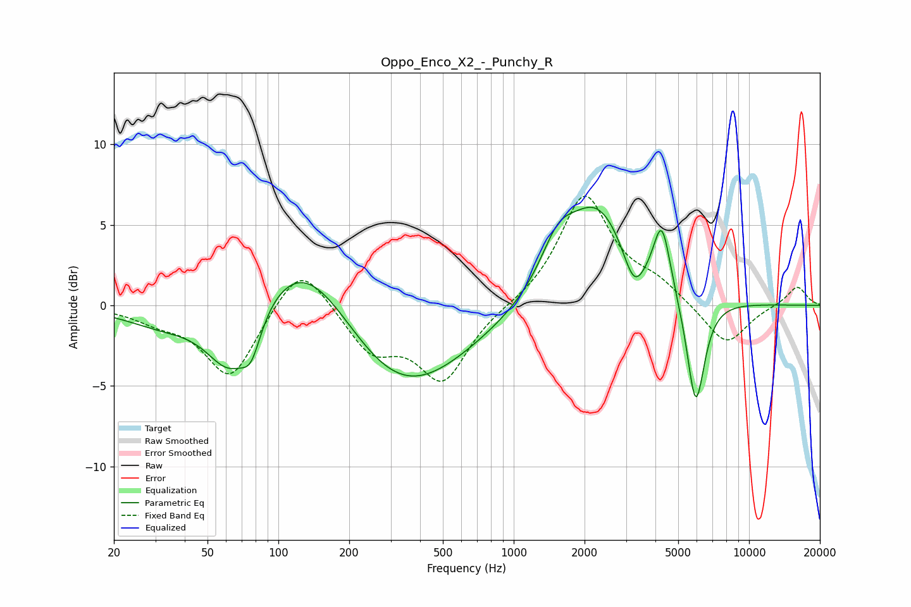

# Oppo_Enco_X2_-_Punchy_R
See [usage instructions](https://github.com/jaakkopasanen/AutoEq#usage) for more options and info.

### Parametric EQs
Apply preamp of -6.2 dB when using parametric equalizer.

|   # | Type    |   Fc (Hz) |    Q |   Gain (dB) |
|-----|---------|-----------|------|-------------|
|   1 | Peaking |        32 | 0.86 |        -1.2 |
|   2 | Peaking |        62 | 1.37 |        -4.4 |
|   3 | Peaking |        77 | 3.45 |        -2   |
|   4 | Peaking |       130 | 0.66 |         5.2 |
|   5 | Peaking |       324 | 0.51 |        -6   |
|   6 | Peaking |      1536 | 1.93 |         2.4 |
|   7 | Peaking |      2269 | 1.01 |         6.1 |
|   8 | Peaking |      3245 | 3.03 |        -2.4 |
|   9 | Peaking |      4259 | 3.92 |         4.1 |
|  10 | Peaking |      5934 | 3.61 |        -6.9 |

### Fixed Band EQs
When using fixed band (also called graphic) equalizer, apply preamp of **-6.9 dB** (if available) and set gains manually with these parameters.

|   # | Type    |   Fc (Hz) |    Q |   Gain (dB) |
|-----|---------|-----------|------|-------------|
|   1 | Peaking |        31 | 1.41 |        -0.7 |
|   2 | Peaking |        62 | 1.41 |        -4.5 |
|   3 | Peaking |       125 | 1.41 |         3   |
|   4 | Peaking |       250 | 1.41 |        -2.7 |
|   5 | Peaking |       500 | 1.41 |        -4.5 |
|   6 | Peaking |      1000 | 1.41 |        -0   |
|   7 | Peaking |      2000 | 1.41 |         6.8 |
|   8 | Peaking |      4000 | 1.41 |         1.1 |
|   9 | Peaking |      8000 | 1.41 |        -2.6 |
|  10 | Peaking |     16000 | 1.41 |         1.2 |

### Graphs

