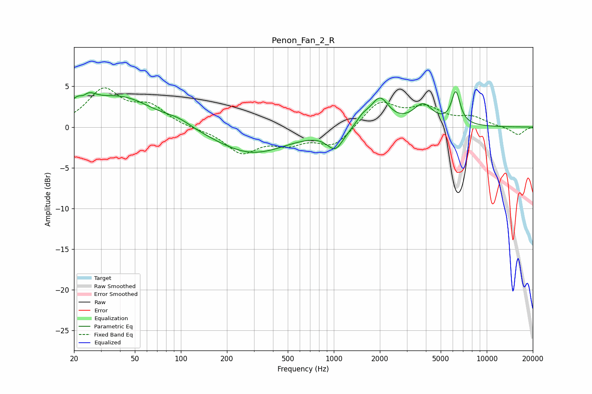

# Penon_Fan_2_R
See [usage instructions](https://github.com/jaakkopasanen/AutoEq#usage) for more options and info.

### Parametric EQs
Apply preamp of -4.5 dB when using parametric equalizer.

|   # | Type    |   Fc (Hz) |    Q |   Gain (dB) |
|-----|---------|-----------|------|-------------|
|   1 | Peaking |        23 | 2.53 |         4.1 |
|   2 | Peaking |        23 | 4.16 |        -2.3 |
|   3 | Peaking |        41 | 0.69 |         3.6 |
|   4 | Peaking |        96 | 1.64 |         0.7 |
|   5 | Peaking |       290 | 0.6  |        -3.3 |
|   6 | Peaking |      1023 | 2.63 |        -2.4 |
|   7 | Peaking |      1545 | 3.26 |         1   |
|   8 | Peaking |      1999 | 2.38 |         3.4 |
|   9 | Peaking |      3832 | 2.2  |         2.5 |
|  10 | Peaking |      6273 | 4.83 |         4   |

### Fixed Band EQs
When using fixed band (also called graphic) equalizer, apply preamp of **-4.9 dB** (if available) and set gains manually with these parameters.

|   # | Type    |   Fc (Hz) |    Q |   Gain (dB) |
|-----|---------|-----------|------|-------------|
|   1 | Peaking |        31 | 1.41 |         4.4 |
|   2 | Peaking |        62 | 1.41 |         2.3 |
|   3 | Peaking |       125 | 1.41 |        -0.2 |
|   4 | Peaking |       250 | 1.41 |        -3   |
|   5 | Peaking |       500 | 1.41 |        -1.7 |
|   6 | Peaking |      1000 | 1.41 |        -2.3 |
|   7 | Peaking |      2000 | 1.41 |         3.1 |
|   8 | Peaking |      4000 | 1.41 |         2.1 |
|   9 | Peaking |      8000 | 1.41 |         1.1 |
|  10 | Peaking |     16000 | 1.41 |        -1   |

### Graphs

