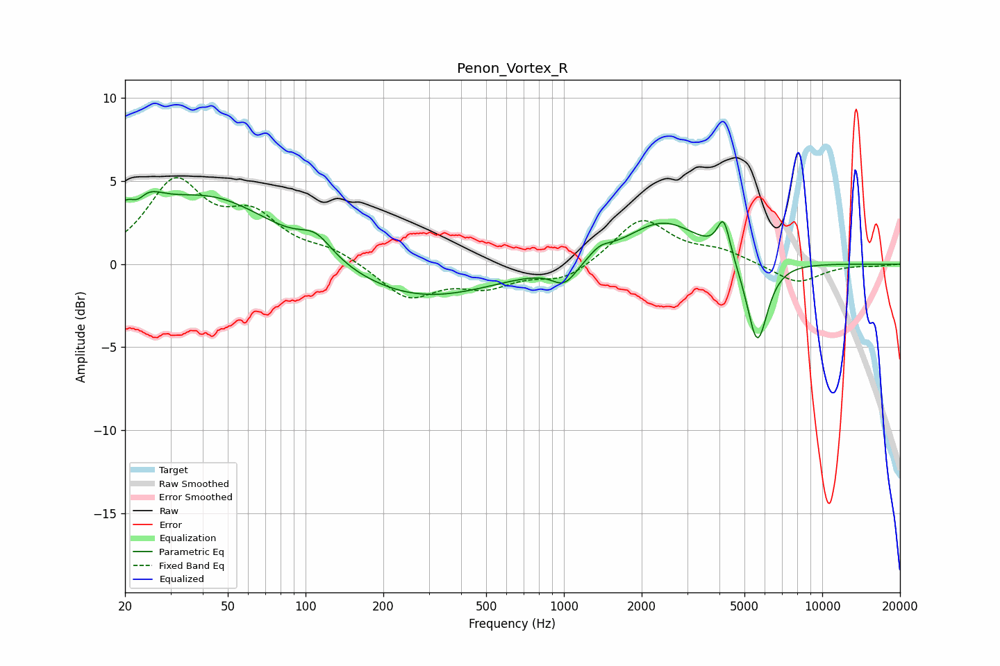

# Penon_Vortex_R
See [usage instructions](https://github.com/jaakkopasanen/AutoEq#usage) for more options and info.

### Parametric EQs
Apply preamp of -4.5 dB when using parametric equalizer.

|   # | Type    |   Fc (Hz) |    Q |   Gain (dB) |
|-----|---------|-----------|------|-------------|
|   1 | Peaking |        22 | 2.3  |         4.3 |
|   2 | Peaking |        22 | 3.52 |        -2.8 |
|   3 | Peaking |        43 | 0.56 |         4   |
|   4 | Peaking |       110 | 2.22 |         1.2 |
|   5 | Peaking |       275 | 0.5  |        -2.2 |
|   6 | Peaking |      1006 | 2.91 |        -1.2 |
|   7 | Peaking |      1376 | 3.36 |         0.5 |
|   8 | Peaking |      2421 | 0.96 |         2.6 |
|   9 | Peaking |      4155 | 5.62 |         2.3 |
|  10 | Peaking |      5604 | 3.39 |        -5.1 |

### Fixed Band EQs
When using fixed band (also called graphic) equalizer, apply preamp of **-5.3 dB** (if available) and set gains manually with these parameters.

|   # | Type    |   Fc (Hz) |    Q |   Gain (dB) |
|-----|---------|-----------|------|-------------|
|   1 | Peaking |        31 | 1.41 |         4.7 |
|   2 | Peaking |        62 | 1.41 |         2.5 |
|   3 | Peaking |       125 | 1.41 |         0.7 |
|   4 | Peaking |       250 | 1.41 |        -2   |
|   5 | Peaking |       500 | 1.41 |        -1.2 |
|   6 | Peaking |      1000 | 1.41 |        -1   |
|   7 | Peaking |      2000 | 1.41 |         2.7 |
|   8 | Peaking |      4000 | 1.41 |         0.7 |
|   9 | Peaking |      8000 | 1.41 |        -1.2 |
|  10 | Peaking |     16000 | 1.41 |        -0.1 |

### Graphs

