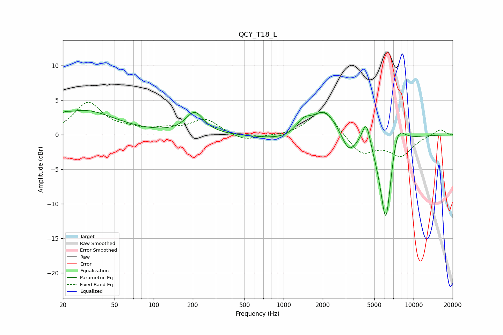

# QCY_T18_L
See [usage instructions](https://github.com/jaakkopasanen/AutoEq#usage) for more options and info.

### Parametric EQs
Apply preamp of -3.6 dB when using parametric equalizer.

|   # | Type    |   Fc (Hz) |    Q |   Gain (dB) |
|-----|---------|-----------|------|-------------|
|   1 | Peaking |        21 | 5.97 |         0.3 |
|   2 | Peaking |        29 | 0.59 |         3.5 |
|   3 | Peaking |       207 | 2.07 |         3.1 |
|   4 | Peaking |      1143 | 0.66 |        -1.1 |
|   5 | Peaking |      1421 | 2.4  |         1.9 |
|   6 | Peaking |      2071 | 1.47 |         4   |
|   7 | Peaking |      3173 | 2.64 |        -2.7 |
|   8 | Peaking |      4326 | 4.36 |         3.8 |
|   9 | Peaking |      6128 | 2.81 |       -14.2 |
|  10 | Peaking |      7435 | 2.38 |         4.7 |

### Fixed Band EQs
When using fixed band (also called graphic) equalizer, apply preamp of **-4.8 dB** (if available) and set gains manually with these parameters.

|   # | Type    |   Fc (Hz) |    Q |   Gain (dB) |
|-----|---------|-----------|------|-------------|
|   1 | Peaking |        31 | 1.41 |         4.6 |
|   2 | Peaking |        62 | 1.41 |         0.6 |
|   3 | Peaking |       125 | 1.41 |         0.7 |
|   4 | Peaking |       250 | 1.41 |         2.2 |
|   5 | Peaking |       500 | 1.41 |        -1   |
|   6 | Peaking |      1000 | 1.41 |        -0.2 |
|   7 | Peaking |      2000 | 1.41 |         3.8 |
|   8 | Peaking |      4000 | 1.41 |        -2.8 |
|   9 | Peaking |      8000 | 1.41 |        -2.9 |
|  10 | Peaking |     16000 | 1.41 |         0.9 |

### Graphs

