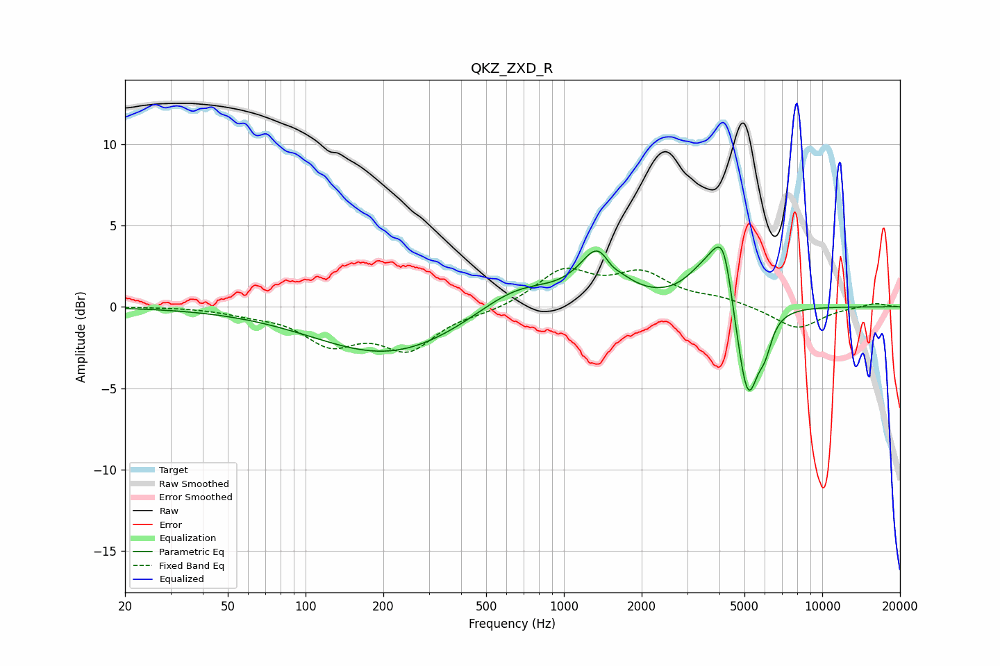

# QKZ_ZXD_R
See [usage instructions](https://github.com/jaakkopasanen/AutoEq#usage) for more options and info.

### Parametric EQs
Apply preamp of -3.8 dB when using parametric equalizer.

|   # | Type    |   Fc (Hz) |    Q |   Gain (dB) |
|-----|---------|-----------|------|-------------|
|   1 | Peaking |       212 | 0.49 |        -3   |
|   2 | Peaking |       655 | 0.9  |         1.7 |
|   3 | Peaking |      1380 | 1.95 |         3.5 |
|   4 | Peaking |      1517 | 3.99 |        -0.8 |
|   5 | Peaking |      3364 | 1.98 |         1.1 |
|   6 | Peaking |      4120 | 2.53 |         4.5 |
|   7 | Peaking |      4183 | 6    |         0.7 |
|   8 | Peaking |      4792 | 2.64 |        -2.1 |
|   9 | Peaking |      5173 | 3.48 |        -5.2 |
|  10 | Peaking |      6008 | 5.31 |        -1.4 |

### Fixed Band EQs
When using fixed band (also called graphic) equalizer, apply preamp of **-2.5 dB** (if available) and set gains manually with these parameters.

|   # | Type    |   Fc (Hz) |    Q |   Gain (dB) |
|-----|---------|-----------|------|-------------|
|   1 | Peaking |        31 | 1.41 |         0   |
|   2 | Peaking |        62 | 1.41 |        -0.3 |
|   3 | Peaking |       125 | 1.41 |        -2.1 |
|   4 | Peaking |       250 | 1.41 |        -2.4 |
|   5 | Peaking |       500 | 1.41 |        -0.3 |
|   6 | Peaking |      1000 | 1.41 |         2.2 |
|   7 | Peaking |      2000 | 1.41 |         1.9 |
|   8 | Peaking |      4000 | 1.41 |         0.4 |
|   9 | Peaking |      8000 | 1.41 |        -1.4 |
|  10 | Peaking |     16000 | 1.41 |         0.2 |

### Graphs

