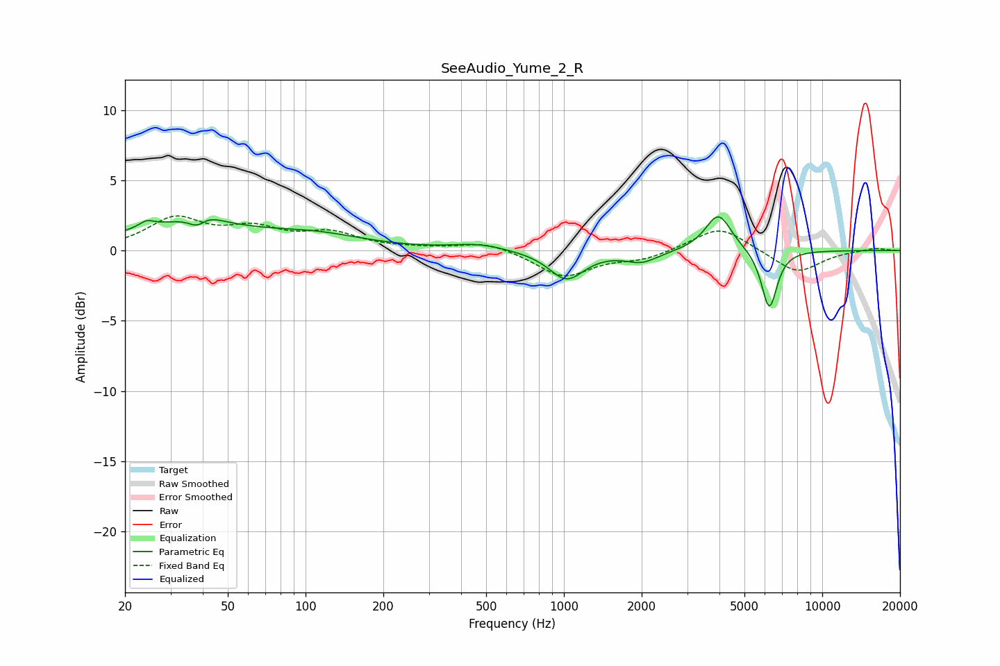

# SeeAudio_Yume_2_R
See [usage instructions](https://github.com/jaakkopasanen/AutoEq#usage) for more options and info.

### Parametric EQs
Apply preamp of -2.5 dB when using parametric equalizer.

|   # | Type    |   Fc (Hz) |    Q |   Gain (dB) |
|-----|---------|-----------|------|-------------|
|   1 | Peaking |        24 | 4.94 |         0.4 |
|   2 | Peaking |        35 | 0.6  |         1.8 |
|   3 | Peaking |        38 | 3.7  |        -1.7 |
|   4 | Peaking |        39 | 2.93 |         1.5 |
|   5 | Peaking |       110 | 0.74 |         0.9 |
|   6 | Peaking |       468 | 1.43 |         0.4 |
|   7 | Peaking |      1024 | 2.1  |        -2.1 |
|   8 | Peaking |      2001 | 2.21 |        -0.8 |
|   9 | Peaking |      3963 | 2.79 |         2.7 |
|  10 | Peaking |      6238 | 4.54 |        -4.2 |

### Fixed Band EQs
When using fixed band (also called graphic) equalizer, apply preamp of **-2.6 dB** (if available) and set gains manually with these parameters.

|   # | Type    |   Fc (Hz) |    Q |   Gain (dB) |
|-----|---------|-----------|------|-------------|
|   1 | Peaking |        31 | 1.41 |         2.2 |
|   2 | Peaking |        62 | 1.41 |         1.3 |
|   3 | Peaking |       125 | 1.41 |         1.1 |
|   4 | Peaking |       250 | 1.41 |         0.1 |
|   5 | Peaking |       500 | 1.41 |         0.6 |
|   6 | Peaking |      1000 | 1.41 |        -1.9 |
|   7 | Peaking |      2000 | 1.41 |        -0.6 |
|   8 | Peaking |      4000 | 1.41 |         1.8 |
|   9 | Peaking |      8000 | 1.41 |        -1.6 |
|  10 | Peaking |     16000 | 1.41 |         0.2 |

### Graphs

