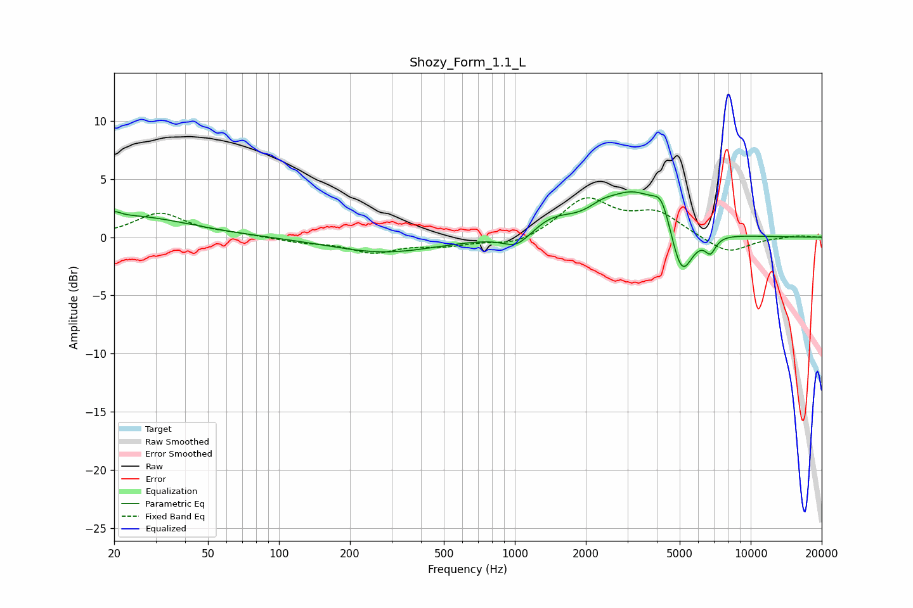

# Shozy_Form_1.1_L
See [usage instructions](https://github.com/jaakkopasanen/AutoEq#usage) for more options and info.

### Parametric EQs
Apply preamp of -4.0 dB when using parametric equalizer.

|   # | Type    |   Fc (Hz) |    Q |   Gain (dB) |
|-----|---------|-----------|------|-------------|
|   1 | Peaking |        20 | 5.23 |         0.5 |
|   2 | Peaking |        23 | 0.58 |         1.8 |
|   3 | Peaking |       279 | 0.63 |        -1.3 |
|   4 | Peaking |      1020 | 2.41 |        -1.2 |
|   5 | Peaking |      1445 | 1.6  |         1.3 |
|   6 | Peaking |      2337 | 2.51 |         0.7 |
|   7 | Peaking |      3220 | 1.1  |         3.8 |
|   8 | Peaking |      4196 | 3.85 |         2.1 |
|   9 | Peaking |      5094 | 2.92 |        -4.6 |
|  10 | Peaking |      6750 | 5.96 |        -1.3 |

### Fixed Band EQs
When using fixed band (also called graphic) equalizer, apply preamp of **-3.5 dB** (if available) and set gains manually with these parameters.

|   # | Type    |   Fc (Hz) |    Q |   Gain (dB) |
|-----|---------|-----------|------|-------------|
|   1 | Peaking |        31 | 1.41 |         2   |
|   2 | Peaking |        62 | 1.41 |         0.2 |
|   3 | Peaking |       125 | 1.41 |        -0.4 |
|   4 | Peaking |       250 | 1.41 |        -1.2 |
|   5 | Peaking |       500 | 1.41 |        -0.6 |
|   6 | Peaking |      1000 | 1.41 |        -0.8 |
|   7 | Peaking |      2000 | 1.41 |         3.2 |
|   8 | Peaking |      4000 | 1.41 |         2   |
|   9 | Peaking |      8000 | 1.41 |        -1.5 |
|  10 | Peaking |     16000 | 1.41 |         0.2 |

### Graphs

