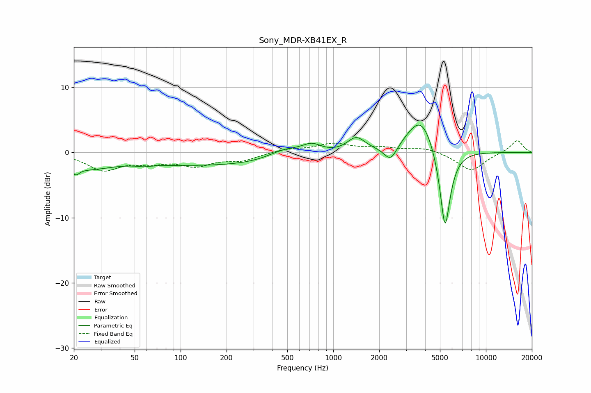

# Sony_MDR-XB41EX_R
See [usage instructions](https://github.com/jaakkopasanen/AutoEq#usage) for more options and info.

### Parametric EQs
Apply preamp of -4.3 dB when using parametric equalizer.

|   # | Type    |   Fc (Hz) |    Q |   Gain (dB) |
|-----|---------|-----------|------|-------------|
|   1 | Peaking |        20 | 5.41 |        -1.3 |
|   2 | Peaking |        24 | 0.89 |        -1.9 |
|   3 | Peaking |        58 | 3.28 |        -0.3 |
|   4 | Peaking |       173 | 0.22 |        -2   |
|   5 | Peaking |       481 | 1.27 |         1.6 |
|   6 | Peaking |       723 | 2.1  |         1.6 |
|   7 | Peaking |      1412 | 2.37 |         2.3 |
|   8 | Peaking |      2374 | 3.27 |        -2.5 |
|   9 | Peaking |      3769 | 1.49 |         5.9 |
|  10 | Peaking |      5397 | 3.83 |       -13.3 |

### Fixed Band EQs
When using fixed band (also called graphic) equalizer, apply preamp of **-1.9 dB** (if available) and set gains manually with these parameters.

|   # | Type    |   Fc (Hz) |    Q |   Gain (dB) |
|-----|---------|-----------|------|-------------|
|   1 | Peaking |        31 | 1.41 |        -2.6 |
|   2 | Peaking |        62 | 1.41 |        -1.2 |
|   3 | Peaking |       125 | 1.41 |        -1.8 |
|   4 | Peaking |       250 | 1.41 |        -1.1 |
|   5 | Peaking |       500 | 1.41 |         0.5 |
|   6 | Peaking |      1000 | 1.41 |         1.3 |
|   7 | Peaking |      2000 | 1.41 |         0.7 |
|   8 | Peaking |      4000 | 1.41 |         0.7 |
|   9 | Peaking |      8000 | 1.41 |        -2.8 |
|  10 | Peaking |     16000 | 1.41 |         1.9 |

### Graphs

