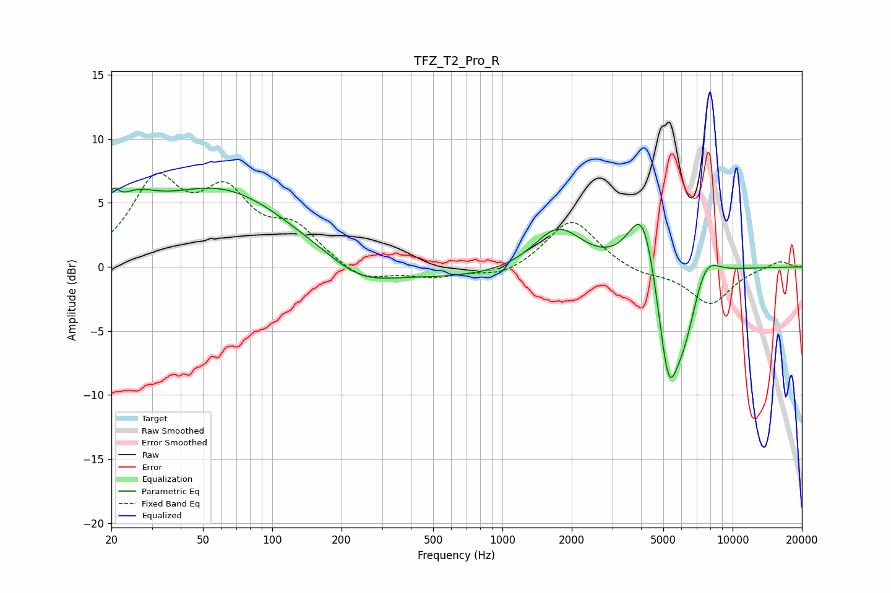

# TFZ_T2_Pro_R
See [usage instructions](https://github.com/jaakkopasanen/AutoEq#usage) for more options and info.

### Parametric EQs
Apply preamp of -6.3 dB when using parametric equalizer.

|   # | Type    |   Fc (Hz) |    Q |   Gain (dB) |
|-----|---------|-----------|------|-------------|
|   1 | Peaking |        20 | 5.69 |         1.8 |
|   2 | Peaking |        25 | 1.47 |         2.4 |
|   3 | Peaking |        61 | 0.44 |         6.2 |
|   4 | Peaking |       240 | 1.08 |        -1.4 |
|   5 | Peaking |       557 | 0.18 |        -1.1 |
|   6 | Peaking |      1741 | 1.28 |         3.7 |
|   7 | Peaking |      4085 | 2.22 |         6.1 |
|   8 | Peaking |      5270 | 2.78 |        -9.4 |
|   9 | Peaking |      6211 | 2.61 |        -3.5 |
|  10 | Peaking |      7671 | 2.49 |         1.9 |

### Fixed Band EQs
When using fixed band (also called graphic) equalizer, apply preamp of **-7.4 dB** (if available) and set gains manually with these parameters.

|   # | Type    |   Fc (Hz) |    Q |   Gain (dB) |
|-----|---------|-----------|------|-------------|
|   1 | Peaking |        31 | 1.41 |         6.3 |
|   2 | Peaking |        62 | 1.41 |         5   |
|   3 | Peaking |       125 | 1.41 |         2.7 |
|   4 | Peaking |       250 | 1.41 |        -1.2 |
|   5 | Peaking |       500 | 1.41 |        -0.7 |
|   6 | Peaking |      1000 | 1.41 |        -0.8 |
|   7 | Peaking |      2000 | 1.41 |         3.8 |
|   8 | Peaking |      4000 | 1.41 |        -0.6 |
|   9 | Peaking |      8000 | 1.41 |        -2.9 |
|  10 | Peaking |     16000 | 1.41 |         0.5 |

### Graphs

