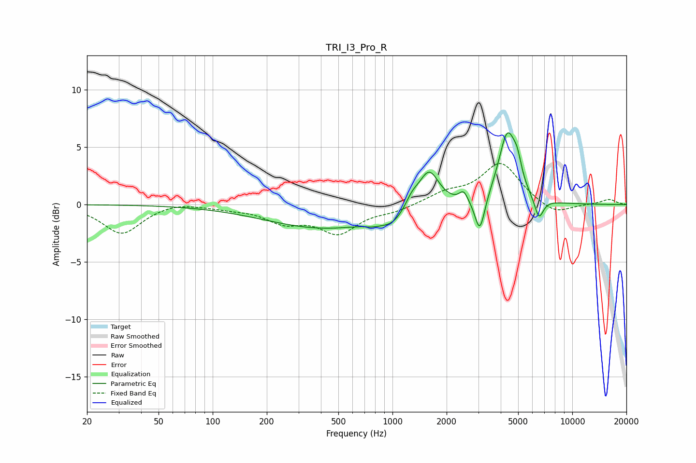

# TRI_I3_Pro_R
See [usage instructions](https://github.com/jaakkopasanen/AutoEq#usage) for more options and info.

### Parametric EQs
Apply preamp of -6.3 dB when using parametric equalizer.

|   # | Type    |   Fc (Hz) |    Q |   Gain (dB) |
|-----|---------|-----------|------|-------------|
|   1 | Peaking |       425 | 0.42 |        -2.1 |
|   2 | Peaking |       779 | 2.89 |        -0.3 |
|   3 | Peaking |       997 | 2.27 |        -0.9 |
|   4 | Peaking |      1286 | 3.94 |         0.9 |
|   5 | Peaking |      1595 | 2.48 |         3.3 |
|   6 | Peaking |      2489 | 5.99 |         0.9 |
|   7 | Peaking |      3061 | 5.14 |        -3.2 |
|   8 | Peaking |      4359 | 2.85 |         6.1 |
|   9 | Peaking |      4949 | 6    |         1.4 |
|  10 | Peaking |      6524 | 5.48 |        -1.8 |

### Fixed Band EQs
When using fixed band (also called graphic) equalizer, apply preamp of **-3.7 dB** (if available) and set gains manually with these parameters.

|   # | Type    |   Fc (Hz) |    Q |   Gain (dB) |
|-----|---------|-----------|------|-------------|
|   1 | Peaking |        31 | 1.41 |        -2.5 |
|   2 | Peaking |        62 | 1.41 |         0.3 |
|   3 | Peaking |       125 | 1.41 |        -0.2 |
|   4 | Peaking |       250 | 1.41 |        -1.4 |
|   5 | Peaking |       500 | 1.41 |        -2.3 |
|   6 | Peaking |      1000 | 1.41 |        -0.5 |
|   7 | Peaking |      2000 | 1.41 |         0.9 |
|   8 | Peaking |      4000 | 1.41 |         3.6 |
|   9 | Peaking |      8000 | 1.41 |        -1   |
|  10 | Peaking |     16000 | 1.41 |         0.5 |

### Graphs

