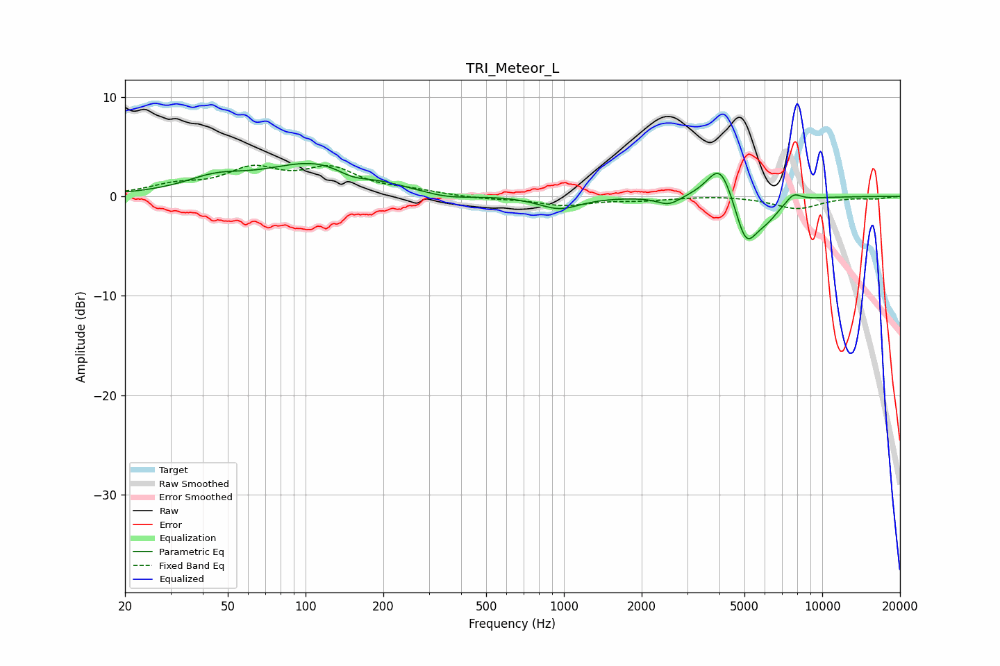

# TRI_Meteor_L
See [usage instructions](https://github.com/jaakkopasanen/AutoEq#usage) for more options and info.

### Parametric EQs
Apply preamp of -3.4 dB when using parametric equalizer.

|   # | Type    |   Fc (Hz) |    Q |   Gain (dB) |
|-----|---------|-----------|------|-------------|
|   1 | Peaking |        45 | 1.21 |         1.3 |
|   2 | Peaking |       112 | 0.7  |         3.4 |
|   3 | Peaking |       152 | 2.23 |        -0.8 |
|   4 | Peaking |       351 | 1.47 |        -0.6 |
|   5 | Peaking |       960 | 1.77 |        -1.3 |
|   6 | Peaking |      2545 | 3.16 |        -0.9 |
|   7 | Peaking |      4035 | 2.72 |         3.9 |
|   8 | Peaking |      5063 | 3.17 |        -4.7 |
|   9 | Peaking |      6088 | 2.53 |        -1.7 |
|  10 | Peaking |      7737 | 4.52 |         0.9 |

### Fixed Band EQs
When using fixed band (also called graphic) equalizer, apply preamp of **-3.2 dB** (if available) and set gains manually with these parameters.

|   # | Type    |   Fc (Hz) |    Q |   Gain (dB) |
|-----|---------|-----------|------|-------------|
|   1 | Peaking |        31 | 1.41 |         1   |
|   2 | Peaking |        62 | 1.41 |         2.5 |
|   3 | Peaking |       125 | 1.41 |         2.5 |
|   4 | Peaking |       250 | 1.41 |         0.5 |
|   5 | Peaking |       500 | 1.41 |        -0.2 |
|   6 | Peaking |      1000 | 1.41 |        -0.9 |
|   7 | Peaking |      2000 | 1.41 |        -0.3 |
|   8 | Peaking |      4000 | 1.41 |         0.1 |
|   9 | Peaking |      8000 | 1.41 |        -1.2 |
|  10 | Peaking |     16000 | 1.41 |        -0.2 |

### Graphs

