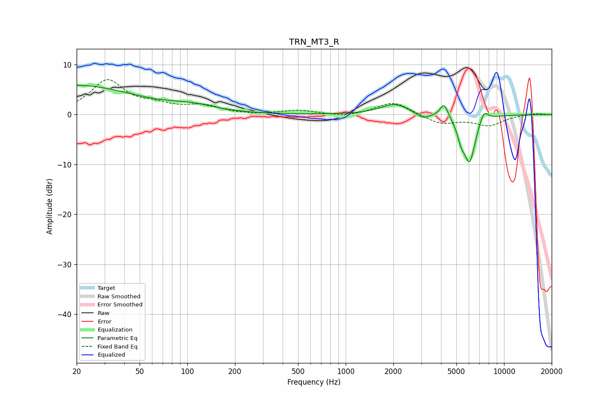

# TRN_MT3_R
See [usage instructions](https://github.com/jaakkopasanen/AutoEq#usage) for more options and info.

### Parametric EQs
Apply preamp of -6.0 dB when using parametric equalizer.

|   # | Type    |   Fc (Hz) |    Q |   Gain (dB) |
|-----|---------|-----------|------|-------------|
|   1 | Peaking |        20 | 0.39 |         5.8 |
|   2 | Peaking |        20 | 5.81 |         2.6 |
|   3 | Peaking |        20 | 6    |        -2.6 |
|   4 | Peaking |       108 | 0.98 |         1.2 |
|   5 | Peaking |      2038 | 1.64 |         2.2 |
|   6 | Peaking |      3074 | 3.38 |        -1.1 |
|   7 | Peaking |      4186 | 5.66 |         2.9 |
|   8 | Peaking |      5364 | 5.97 |        -2.7 |
|   9 | Peaking |      6062 | 3.71 |        -9.3 |
|  10 | Peaking |      7460 | 4.92 |         2.4 |

### Fixed Band EQs
When using fixed band (also called graphic) equalizer, apply preamp of **-7.1 dB** (if available) and set gains manually with these parameters.

|   # | Type    |   Fc (Hz) |    Q |   Gain (dB) |
|-----|---------|-----------|------|-------------|
|   1 | Peaking |        31 | 1.41 |         6.7 |
|   2 | Peaking |        62 | 1.41 |         1.4 |
|   3 | Peaking |       125 | 1.41 |         1.6 |
|   4 | Peaking |       250 | 1.41 |        -0.2 |
|   5 | Peaking |       500 | 1.41 |         0.8 |
|   6 | Peaking |      1000 | 1.41 |        -0.5 |
|   7 | Peaking |      2000 | 1.41 |         2.6 |
|   8 | Peaking |      4000 | 1.41 |        -1.9 |
|   9 | Peaking |      8000 | 1.41 |        -2.1 |
|  10 | Peaking |     16000 | 1.41 |         0.3 |

### Graphs

